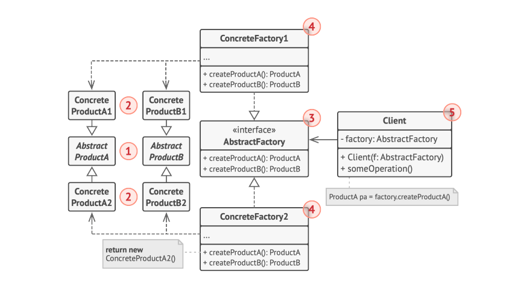
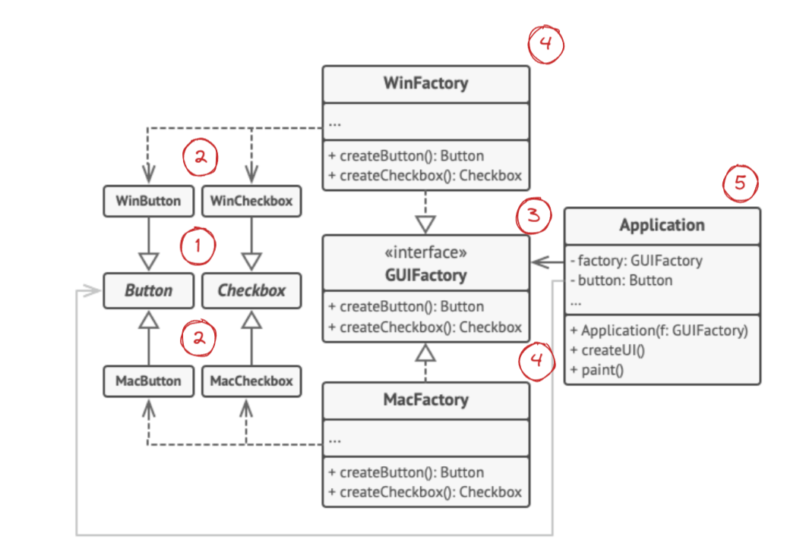

# Abstract Factory Pattern: Creating Families of Objects

The Abstract Factory pattern is a **creational design pattern** that provides an interface for creating families of related or dependent objects without specifying their concrete classes.

> **Core principle:** Program to interfaces, not implementations. Abstract Factory lets you swap entire product families by switching factories — without touching the client code.

---

## The Problem It Solves

Imagine you're building a UI framework that needs to support multiple themes (Light, Dark) or multiple platforms (Windows, macOS). You need to create families of related components — buttons, checkboxes, text fields — that are visually consistent within each family.

Without a pattern, you'd end up with:
- Scattered `if/else` or `switch` statements for each product type
- Tight coupling between client code and concrete classes
- Risk of mixing products from different families (e.g., a Windows button with a macOS dialog)

The Abstract Factory pattern solves all three issues.

---

## Key Components



| Component | Responsibility |
|---|---|
| **Abstract Product** | Declares the interface for each distinct type of product (e.g., `Button`, `Checkbox`) |
| **Concrete Product** | Implements the abstract product interface for a specific variant (e.g., `WindowsButton`, `MacOSButton`) |
| **Abstract Factory** | Declares creation methods for each abstract product type |
| **Concrete Factory** | Implements creation methods, producing a specific family of products (e.g., `WindowsFactory`, `MacOSFactory`) |
| **Client** | Uses only the abstract factory and abstract product interfaces — never concrete classes |

---

## How It Works

1. The client receives a factory object (usually at startup or via configuration)
2. The client calls factory methods to create products — always getting the right variant for that family
3. The client uses the products through their abstract interfaces, unaware of the concrete classes

This guarantees that products from the same factory are always **compatible with each other**.

---

## Example: Cross-Platform UI Application



Consider a cross-platform application that renders UI components differently on each operating system:

```typescript
// Abstract Products
interface Button {
  render(): void;
  onClick(action: () => void): void;
}

interface Checkbox {
  render(): void;
  isChecked(): boolean;
}

// Abstract Factory
interface UIFactory {
  createButton(): Button;
  createCheckbox(): Checkbox;
}

// Concrete Products — Windows
class WindowsButton implements Button {
  render(): void { console.log('Rendering a Windows-style button'); }
  onClick(action: () => void): void { action(); }
}

class WindowsCheckbox implements Checkbox {
  render(): void { console.log('Rendering a Windows-style checkbox'); }
  isChecked(): boolean { return false; }
}

// Concrete Factory — Windows
class WindowsFactory implements UIFactory {
  createButton(): Button { return new WindowsButton(); }
  createCheckbox(): Checkbox { return new WindowsCheckbox(); }
}

// Concrete Products — macOS
class MacOSButton implements Button {
  render(): void { console.log('Rendering a macOS-style button'); }
  onClick(action: () => void): void { action(); }
}

class MacOSFactory implements UIFactory {
  createButton(): Button { return new MacOSButton(); }
  createCheckbox(): Checkbox { return new MacOSCheckbox(); }
}

// Client — works with ANY factory without knowing concrete classes
class Application {
  private button: Button;
  private checkbox: Checkbox;

  constructor(factory: UIFactory) {
    this.button = factory.createButton();
    this.checkbox = factory.createCheckbox();
  }

  render(): void {
    this.button.render();
    this.checkbox.render();
  }
}

// Bootstrap: choose factory based on OS
const factory = process.platform === 'win32' ? new WindowsFactory() : new MacOSFactory();
const app = new Application(factory);
app.render();
```

---

## Real-World Use Cases

| Domain | Product Family | Variants |
|--------|---------------|---------|
| **UI Frameworks** | Button, Dialog, Checkbox | Light theme, Dark theme |
| **Cross-platform apps** | Window, Button, Menu | Windows, macOS, Linux |
| **Database clients** | Connection, Query, Transaction | MySQL, PostgreSQL, SQLite |
| **Cloud SDKs** | Storage, Queue, Compute | AWS, Azure, GCP |
| **Document formats** | Document, Page, Paragraph | PDF, HTML, DOCX |

---

## Abstract Factory vs. Factory Method

| Aspect | Factory Method | Abstract Factory |
|--------|---------------|-----------------|
| **Creates** | One product | A family of related products |
| **Mechanism** | Subclassing | Object composition |
| **Focus** | Defer instantiation to subclasses | Ensure product family consistency |
| **Complexity** | Lower | Higher — more interfaces and classes |

---

## Benefits and Trade-offs

| ✅ Benefits | ⚠️ Trade-offs |
|------------|--------------|
| Guarantees compatibility between products in a family | Adding new product types requires changing all factory interfaces |
| Eliminates coupling between client and concrete classes | Can introduce a lot of interfaces and classes |
| Easy to swap entire product families at runtime | More complex than simpler creation patterns |
| Single Responsibility — product creation is centralized | |
| Open/Closed — add new families without modifying client code | |

---

## Conclusion

The Abstract Factory pattern is the go-to solution when your system needs to work with multiple families of related products, and you want to enforce consistency within each family. By programming entirely to interfaces — both for factories and products — you achieve a highly modular, swappable architecture where entire product families can be replaced with a single configuration change.
