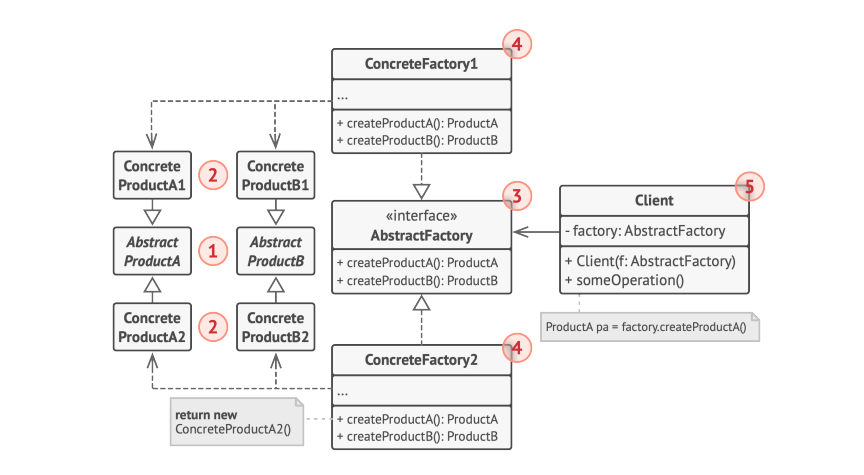
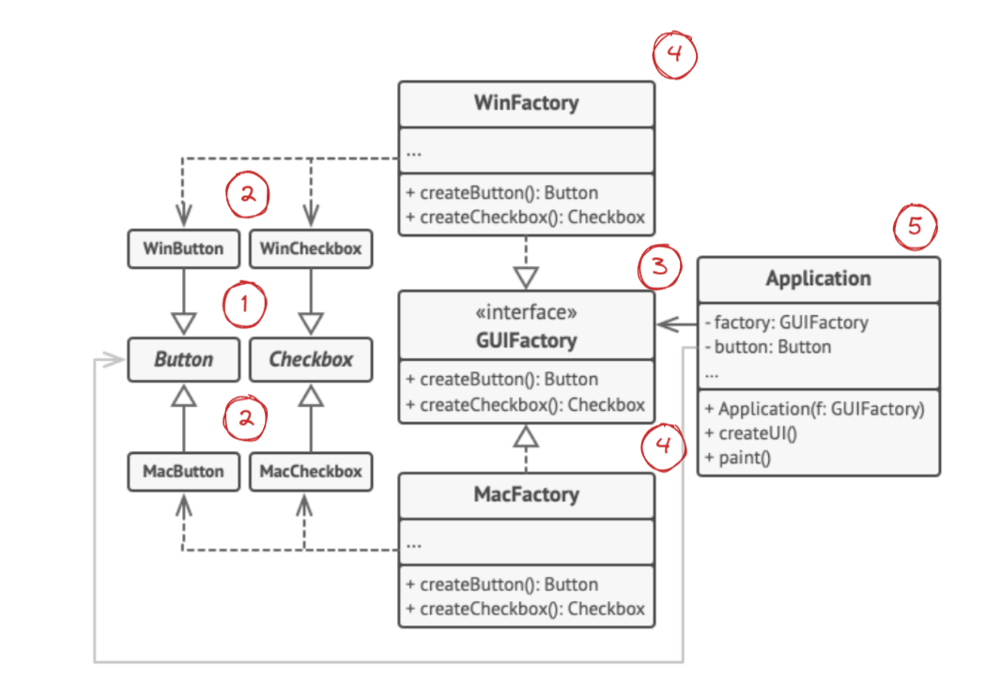

# Abstract Factory Pattern: Creating Family of Objects

The Abstract Factory pattern provides an interface to create families of related objects without specifying their concrete classes.

## Key Components of the Abstract Factory Pattern

1.  **Abstract Products**: Abstract Products declare interfaces for a group of distinct but related products that form a product family. Each abstract product represents a specific type of object, such as a chair or a sofa.

2.  **Concrete Products**: Concrete Products are distinct implementations of abstract products, grouped by variants. Each abstract product (e.g., chair or sofa) must be implemented in all given variants (e.g., Victorian or Modern).

3.  **Abstract Factory Interface**: The Abstract Factory interface declares a set of methods to create each of the abstract products. This interface allows you to create different types of products without exposing their concrete implementations.
    
4.  **Concrete Factories**: Concrete Factories implement methods for creating the abstract products declared in the Abstract Factory interface. Each concrete factory represents a specific family of products, such as the Victorian furniture family or the Modern furniture family.
    

## Example: Cross-Platform Application

To illustrate the Abstract Factory pattern, imagine a cross-platform application that needs to support multiple operating systems. The application requires the creation of various UI components, such as buttons, menus, and text fields, which may have different implementations for each platform.

## Conclusion

The Abstract Factory pattern is a powerful creational design pattern that allows you to create families of related objects without specifying their concrete classes. By defining abstract product interfaces and concrete product implementations in separate factories, the pattern facilitates the construction of complex object families in a flexible and extensible manner.

In our cross-platform application example, the Abstract Factory pattern would enable you to create UI components for different operating systems without tightly coupling the application code to specific platform implementations. By adopting the Abstract Factory pattern, you can achieve a high level of modularity and adaptability in your software, making it easier to support different product families with minimal code changes.
