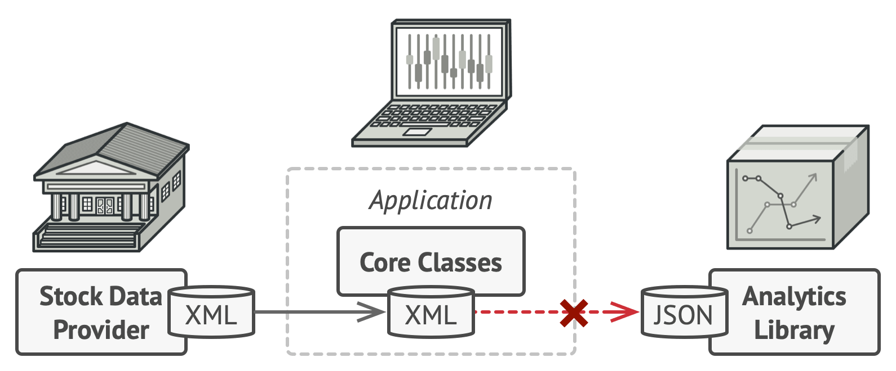
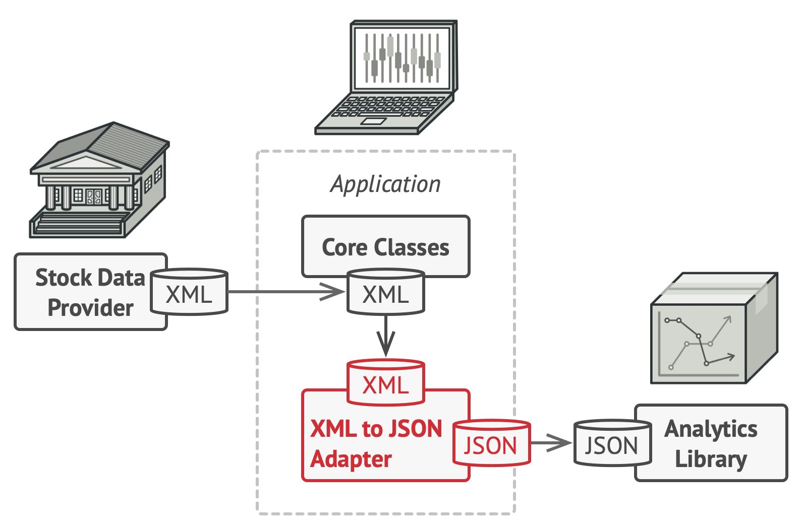
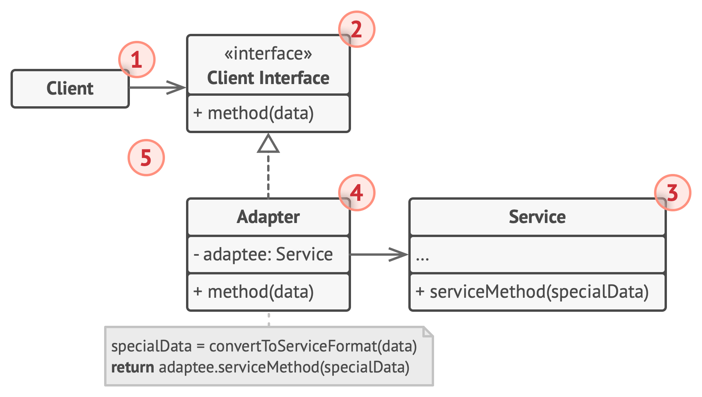

# Adapter Pattern: Bridging Incompatible Interfaces

The Adapter pattern is a **structural design pattern** that allows objects with incompatible interfaces to collaborate. It acts as a translator between two otherwise incompatible systems — without modifying either one.

> **Real-world analogy:** A power plug adapter lets your European device work in a US socket. The device and the socket don't change — the adapter bridges the gap between them.

---

## The Problem It Solves



In software, you often face situations where:
- You want to use an existing class, but its interface doesn't match what your code expects
- You need to integrate a **third-party library** or **legacy system** that you cannot modify
- Multiple services need to communicate, but they each speak a different "language"

Changing either the client or the service to fix the incompatibility would break the Single Responsibility Principle and risk introducing bugs in working code.

---

## The Solution: The Adapter



You create an **adapter** — a special class that:
1. Implements the interface the client expects
2. Wraps the incompatible service
3. Translates calls from the client interface into calls the service understands

The client sees only the interface it knows. The service doesn't change. The adapter does all the translation work in between.

---

## Structure



| Component | Responsibility |
|---|---|
| **Client** | Contains the existing business logic; works only with the client interface |
| **Client Interface** | Defines the contract that the client expects all collaborators to follow |
| **Service** | A useful class (e.g., third-party or legacy) with an incompatible interface |
| **Adapter** | Implements the client interface and wraps the service, translating calls between them |

---

## Code Example

```typescript
// The interface the client expects
interface AnalyticsLogger {
  log(eventName: string, payload: Record<string, unknown>): void;
}

// A legacy/third-party logging service with an incompatible interface
class LegacyLogger {
  writeLog(message: string, data: string): void {
    console.log(`[LEGACY] ${message}: ${data}`);
  }
}

// The Adapter: implements the expected interface, wraps the legacy service
class LegacyLoggerAdapter implements AnalyticsLogger {
  private legacyLogger: LegacyLogger;

  constructor(legacyLogger: LegacyLogger) {
    this.legacyLogger = legacyLogger;
  }

  log(eventName: string, payload: Record<string, unknown>): void {
    // Translate from modern interface to legacy interface
    const message = eventName;
    const data = JSON.stringify(payload);
    this.legacyLogger.writeLog(message, data);
  }
}

// Client code — works with the interface it expects
function trackUserAction(logger: AnalyticsLogger, action: string): void {
  logger.log(action, { timestamp: Date.now(), user: 'igloar96' });
}

// Wire it up — client never knows it's talking to a legacy system
const adapter = new LegacyLoggerAdapter(new LegacyLogger());
trackUserAction(adapter, 'button_click');
```

---

## Real-World Use Cases

| Scenario | Client Expects | Service Provides | Adapter Does |
|----------|---------------|-----------------|-------------|
| **Payment gateways** | `charge(amount, currency)` | Vendor-specific API | Translates parameters and error codes |
| **Database drivers** | Standard SQL interface | DB-specific protocol | Maps queries to driver calls |
| **Cloud storage** | `upload(key, data)` | S3/GCS/Azure Blob SDK | Wraps vendor SDK behind common interface |
| **Logging libraries** | `log(level, message)` | Winston, Pino, Bunyan | Adapts each logger behind a shared interface |
| **Legacy system integration** | Modern REST API | Old SOAP/XML service | Converts request/response formats |

---

## Two Flavors of Adapter

### Object Adapter (Composition)
Uses object composition — the adapter holds a reference to the service object. This is the most common and flexible approach (shown in the example above).

### Class Adapter (Multiple Inheritance)
Uses class inheritance — the adapter inherits from both the target interface and the service class. Only applicable in languages that support multiple inheritance (e.g., C++). Less flexible because it's tied to the concrete service class.

| | Object Adapter | Class Adapter |
|---|---|---|
| **Mechanism** | Composition | Inheritance |
| **Flexibility** | High — can adapt any subclass of service | Low — tied to one concrete service |
| **Language support** | All OOP languages | Requires multiple inheritance |

---

## Benefits and Trade-offs

| ✅ Benefits | ⚠️ Trade-offs |
|------------|--------------|
| Integrates incompatible interfaces without modifying either side | Adds an extra layer of indirection |
| Follows Single Responsibility — conversion logic is isolated | Can make the codebase harder to understand if overused |
| Follows Open/Closed — add new adapters without touching existing code | May introduce a slight performance overhead |
| Enables gradual migration from legacy to modern systems | Multiple adapters for multiple services can feel like boilerplate |

---

## Conclusion

The Adapter pattern is indispensable in real-world software engineering, where you constantly integrate systems you don't control — third-party APIs, legacy codebases, vendor SDKs. By creating a thin translation layer, you keep your business logic clean and decoupled from external details, making it far easier to swap or upgrade those external systems in the future.
