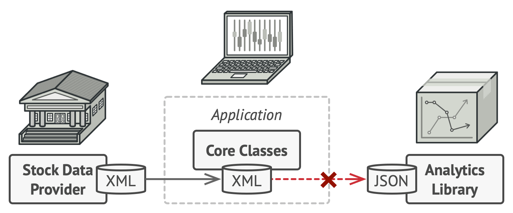
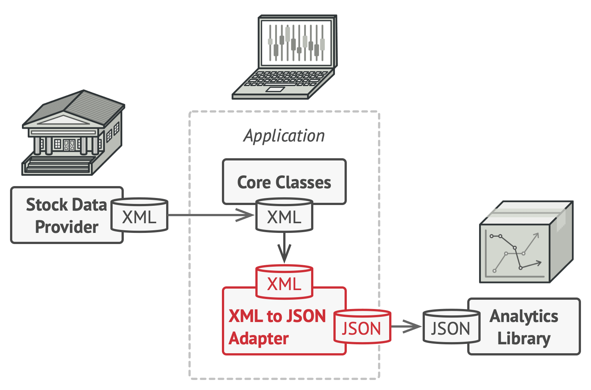
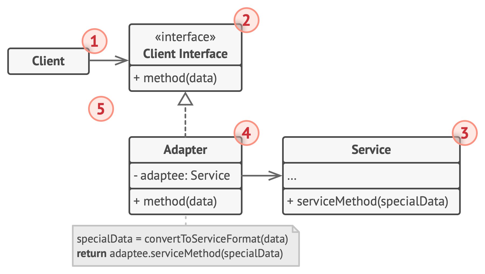

# Adapter Pattern: Bridging Incompatible Interfaces

The Adapter pattern is a structural design pattern that enables objects with incompatible interfaces to collaborate seamlessly.

## Implementing Adapter

To overcome the incompatibility issue, you can create an adapter. The adapter acts as a special object that converts the interface of one object into a format understandable by another object.

## Structure of the Adapter Pattern

The Adapter pattern comprises the following components:

1.  **Client**: This class contains the existing business logic of the program.
    
2.  **Client Interface**: The Client Interface describes a protocol that other classes must follow to collaborate with the client code.
    
3.  **Service**: This is a useful class, usually a 3rd-party or legacy component. The client cannot use this class directly due to its incompatible interface.
    
4.  **Adapter**: The Adapter is a class that can work with both the client and the service. It implements the client interface while wrapping the service object. The adapter receives calls from the client via the adapter interface and translates them into calls to the wrapped service object in a format it can understand.
    

## Conclusion

The Adapter pattern is a valuable tool for bridging incompatible interfaces, allowing different components to work together harmoniously. By using adapters, you can integrate new functionalities and third-party libraries into your application without disrupting the existing codebase.
