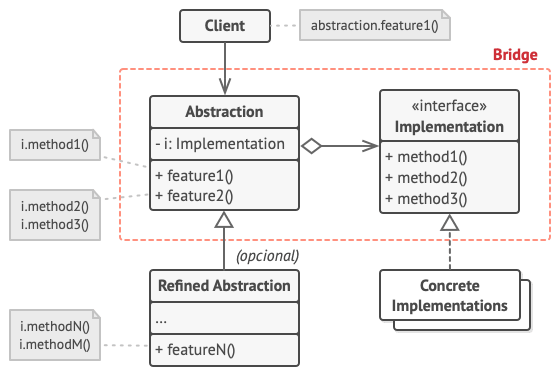
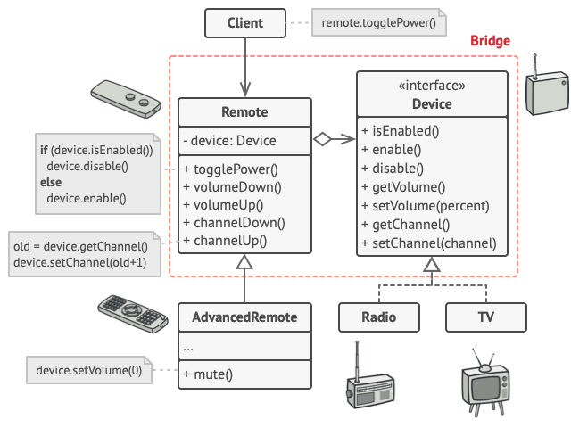

# Bridge Pattern: Building Flexible and Efficient Abstractions

The Bridge pattern is a **structural design pattern** that splits a large class (or a set of closely related classes) into two separate hierarchies — **abstraction** and **implementation** — which can then be developed and evolved independently of each other.

> **Core principle:** "Prefer composition over inheritance." Instead of creating a deep inheritance tree to cover all combinations of abstraction and implementation, the Bridge pattern uses composition to link them at runtime.

---

## The Problem It Solves

Inheritance-based designs often lead to **class explosion**. Imagine you have a `Shape` class with two subclasses: `Circle` and `Square`. Now you need to add colors — Red and Blue. You end up with:

- `RedCircle`, `BlueCircle`, `RedSquare`, `BlueSquare`

With 3 shapes and 4 colors, that's already 12 classes. The Bridge pattern solves this by separating the concerns into two independent hierarchies.

---

## Structure



| Component | Responsibility |
|---|---|
| **Abstraction** | High-level control layer; holds a reference to the implementation object |
| **Refined Abstraction** | Extends the abstraction with additional features |
| **Implementation** (interface) | Declares the interface for low-level operations; common to all concrete implementations |
| **Concrete Implementation** | Platform-specific code that implements the implementation interface |

The Abstraction delegates actual work to the linked Implementation object rather than doing everything itself.

---

## Example: Remote Control and Devices



A classic example: a remote control (abstraction) that works with any TV or Radio (implementation). The remote and the device evolve independently — you can add a new remote type (e.g., advanced remote with volume memory) without touching device code, and vice versa.

```typescript
// Implementation interface
interface Device {
  isEnabled(): boolean;
  enable(): void;
  disable(): void;
  getVolume(): number;
  setVolume(volume: number): void;
  getChannel(): number;
  setChannel(channel: number): void;
}

// Concrete Implementations
class TV implements Device {
  private power = false;
  private volume = 30;
  private channel = 1;

  isEnabled(): boolean { return this.power; }
  enable(): void { this.power = true; console.log('TV is ON'); }
  disable(): void { this.power = false; console.log('TV is OFF'); }
  getVolume(): number { return this.volume; }
  setVolume(volume: number): void { this.volume = Math.min(100, Math.max(0, volume)); }
  getChannel(): number { return this.channel; }
  setChannel(channel: number): void { this.channel = channel; }
}

class Radio implements Device {
  private power = false;
  private volume = 20;
  private channel = 1;

  isEnabled(): boolean { return this.power; }
  enable(): void { this.power = true; console.log('Radio is ON'); }
  disable(): void { this.power = false; console.log('Radio is OFF'); }
  getVolume(): number { return this.volume; }
  setVolume(volume: number): void { this.volume = volume; }
  getChannel(): number { return this.channel; }
  setChannel(channel: number): void { this.channel = channel; }
}

// Abstraction
class RemoteControl {
  constructor(protected device: Device) {}

  togglePower(): void {
    this.device.isEnabled() ? this.device.disable() : this.device.enable();
  }
  volumeUp(): void { this.device.setVolume(this.device.getVolume() + 10); }
  volumeDown(): void { this.device.setVolume(this.device.getVolume() - 10); }
  channelUp(): void { this.device.setChannel(this.device.getChannel() + 1); }
  channelDown(): void { this.device.setChannel(this.device.getChannel() - 1); }
}

// Refined Abstraction — adds advanced features without touching device code
class AdvancedRemote extends RemoteControl {
  mute(): void { this.device.setVolume(0); }
  jumpToChannel(channel: number): void { this.device.setChannel(channel); }
}

// Usage — any remote works with any device
const tv = new TV();
const remote = new AdvancedRemote(tv);
remote.togglePower(); // TV is ON
remote.volumeUp();
remote.jumpToChannel(5);

const radio = new Radio();
const basicRemote = new RemoteControl(radio);
basicRemote.togglePower(); // Radio is ON
```

---

## Solving the Class Explosion Problem

Going back to the Shape and Color example:

```
Without Bridge:      RedCircle, BlueCircle, RedSquare, BlueSquare (4 classes for 2x2)
With Bridge:         Circle + Square + Red + Blue (4 classes, infinite combinations)
```

```typescript
interface Color {
  applyColor(): string;
}

class Red implements Color { applyColor(): string { return 'red'; } }
class Blue implements Color { applyColor(): string { return 'blue'; } }

abstract class Shape {
  constructor(protected color: Color) {}
  abstract draw(): string;
}

class Circle extends Shape {
  draw(): string { return `Drawing a ${this.color.applyColor()} circle`; }
}

class Square extends Shape {
  draw(): string { return `Drawing a ${this.color.applyColor()} square`; }
}

// Mix and match freely
new Circle(new Red()).draw();   // Drawing a red circle
new Square(new Blue()).draw();  // Drawing a blue square
```

---

## Real-World Use Cases

| Domain | Abstraction | Implementation |
|--------|-------------|---------------|
| **GUI frameworks** | Window, Dialog | Windows API, macOS API, Linux API |
| **Database drivers** | Database client | MySQL, PostgreSQL, SQLite drivers |
| **Notification systems** | Notification sender | Email, SMS, Push, Slack |
| **Rendering engines** | Shape, UI Component | OpenGL, DirectX, Vulkan |
| **Payment processing** | Payment service | Stripe, PayPal, Square |

---

## Bridge vs. Adapter

These two patterns look similar but serve different purposes:

| Aspect | Bridge | Adapter |
|--------|--------|---------|
| **Intent** | Designed upfront to separate abstraction from implementation | Applied after the fact to make incompatible classes work together |
| **Timing** | Proactive — planned before development | Reactive — applied to fix existing incompatibilities |
| **Structure** | Both hierarchies are defined together | Adapts an existing class to a new interface |

---

## Benefits and Trade-offs

| ✅ Benefits | ⚠️ Trade-offs |
|------------|--------------|
| Avoids class explosion from multiple dimensions of variation | Increases overall code complexity with extra classes and interfaces |
| Abstraction and implementation evolve independently | Applying it correctly requires upfront architectural thinking |
| Open/Closed — add new abstractions/implementations without modifying existing code | May be overkill for simple scenarios with just one or two variations |
| Better runtime flexibility — swap implementations dynamically | |

---

## Conclusion

The Bridge pattern shines in systems where multiple independent dimensions of variation exist. By cleanly separating high-level logic (the remote control) from low-level implementation details (the device), it gives you the freedom to extend both sides independently — keeping your architecture flat, composable, and maintainable as complexity grows.
