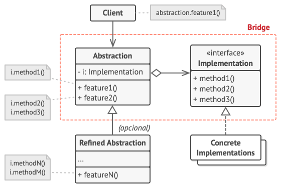
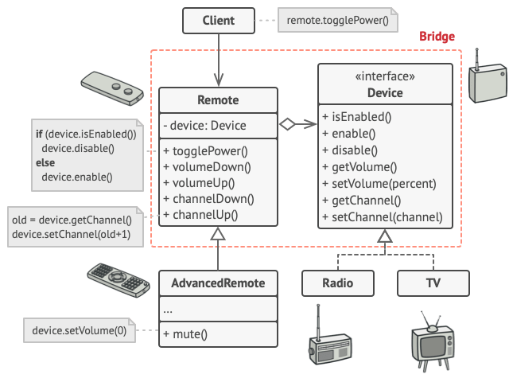

# Bridge Pattern: Building Flexible and Efficient Abstractions

In the world of structural patterns, the Bridge pattern offers an elegant solution for constructing larger and more flexible structures while maintaining efficiency.

The Bridge pattern allows us to create an easy way to add features to a low-level implementation. It is composed of an implementation that handles the "low-level" work and an abstraction that deals with the "high-level" work. The abstraction extends or refines the implementation, adding new features to it.

## Understanding the Bridge Pattern

At its core, the Bridge pattern separates the interface and implementation of a class, enabling them to vary independently. This decoupling allows us to combine different abstractions with different implementations dynamically.

## Class Diagram

The class diagram of the Bridge pattern demonstrates the relationships between the key components: the abstraction, the implementation, and their derived classes.

## Example: Building a TV with Remote Control

Suppose we want to create a TV with a remote control. The Bridge pattern can act as a "link" between the two components, separating the TV's low-level implementation from the remote control's high-level features.

## Implementation Details

The Bridge pattern involves the following elements:

-   **Abstraction**: This represents the high-level interface and is responsible for defining the abstract methods and properties.
    
-   **Implementation**: This represents the low-level interface, implementing the methods defined in the abstraction.
    
-   **Derived Classes**: The abstraction and implementation classes can have derived classes that extend or refine their functionalities.
    

## Benefits of the Bridge Pattern

The Bridge pattern offers several advantages:

-   **Flexibility**: It allows us to combine different abstractions with different implementations dynamically, providing high flexibility in the system.
    
-   **Decoupling**: By separating the interface and implementation, the Bridge pattern reduces tight coupling between classes, making the code more maintainable and scalable.
    
-   **Reusability**: Both the abstraction and implementation classes can be extended independently, promoting code reuse.
    

## Conclusion

The Bridge pattern is a powerful tool for building flexible and efficient abstractions in a structured manner. By decoupling the interface and implementation, the pattern enables seamless combination and modification of components, leading to more maintainable and adaptable systems.

In the example of creating a TV with a remote control, the Bridge pattern showcases its ability to link different components while allowing easy extension of their functionalities. By leveraging the Bridge pattern, developers can construct versatile systems that efficiently handle the complexity of different abstractions and implementations.