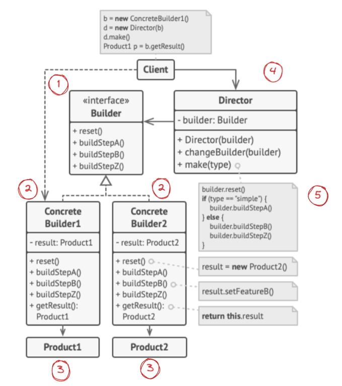

# Builder Pattern: Constructing Complex Objects Step by Step

The Builder pattern is a **creational design pattern** that lets you construct complex objects step by step. It separates the construction of an object from its representation, allowing the same construction process to produce different representations.

> **The core problem it solves:** Telescoping constructors. When an object requires many parameters — some optional, some required — constructor signatures become unmanageable. The Builder pattern replaces the mega-constructor with a fluent, step-by-step API.

---

## The Problem: Constructor Overload

```typescript
// Without Builder — which parameters are which? Are they all required?
const house = new House('brick', 'gabled', true, false, 2, 3, true, 'oak', null);

// With Builder — self-documenting and flexible
const house = new HouseBuilder()
  .setMaterial('brick')
  .setRoofStyle('gabled')
  .setGarage(true)
  .setFloors(2)
  .setBedrooms(3)
  .setSwimmingPool(false)
  .build();
```

---

## Key Components



| Component | Responsibility |
|---|---|
| **Builder Interface** | Declares the construction steps common to all builder types |
| **Concrete Builder** | Provides a specific implementation of construction steps; tracks the product being built |
| **Product** | The complex object being constructed; can have very different internal structures |
| **Director** | Defines the order in which to call construction steps; reuses specific configurations |
| **Client** | Creates a builder, optionally passes it to a director, and retrieves the final product |

---

## How It Works

1. The **Client** creates a builder object
2. Optionally, the client passes the builder to a **Director** which knows how to build standard configurations
3. The Director calls construction steps on the builder
4. The Client retrieves the finished **Product** from the builder

The Director is optional — clients can call steps directly for maximum flexibility.

---

## Code Example

```typescript
// Product
class QueryBuilder {
  private table: string = '';
  private conditions: string[] = [];
  private columns: string[] = ['*'];
  private limit: number | null = null;
  private orderBy: string | null = null;

  setTable(table: string): this { this.table = table; return this; }
  select(...columns: string[]): this { this.columns = columns; return this; }
  where(condition: string): this { this.conditions.push(condition); return this; }
  limitTo(n: number): this { this.limit = n; return this; }
  orderByField(field: string): this { this.orderBy = field; return this; }

  build(): string {
    let query = `SELECT ${this.columns.join(', ')} FROM ${this.table}`;
    if (this.conditions.length) query += ` WHERE ${this.conditions.join(' AND ')}`;
    if (this.orderBy) query += ` ORDER BY ${this.orderBy}`;
    if (this.limit !== null) query += ` LIMIT ${this.limit}`;
    return query;
  }
}

// Usage
const query = new QueryBuilder()
  .setTable('users')
  .select('id', 'name', 'email')
  .where('active = true')
  .where('age > 18')
  .orderByField('created_at')
  .limitTo(50)
  .build();

console.log(query);
// SELECT id, name, email FROM users WHERE active = true AND age > 18 ORDER BY created_at LIMIT 50
```

---

## Example with Director

```typescript
// Builder interface
interface HouseBuilder {
  buildFoundation(): this;
  buildWalls(): this;
  buildRoof(): this;
  buildGarage(): this;
  buildSwimmingPool(): this;
  getResult(): House;
}

// Director — knows how to build standard configurations
class ConstructionDirector {
  buildEconomyHouse(builder: HouseBuilder): House {
    return builder
      .buildFoundation()
      .buildWalls()
      .buildRoof()
      .getResult();
  }

  buildLuxuryHouse(builder: HouseBuilder): House {
    return builder
      .buildFoundation()
      .buildWalls()
      .buildRoof()
      .buildGarage()
      .buildSwimmingPool()
      .getResult();
  }
}

const director = new ConstructionDirector();
const economy = director.buildEconomyHouse(new ConcreteHouseBuilder());
const luxury = director.buildLuxuryHouse(new ConcreteHouseBuilder());
```

---

## Real-World Use Cases

| Domain | Builder Example |
|--------|----------------|
| **SQL query builders** | Knex.js, TypeORM query builder, ActiveRecord |
| **HTTP request builders** | Axios config, Retrofit builder |
| **UI component libraries** | `new DialogBuilder().setTitle(...).setMessage(...).build()` |
| **Configuration objects** | Spring Boot `SecurityFilterChain` builder |
| **Test data factories** | Building complex test fixtures with sensible defaults |
| **Document generation** | PDF builders, HTML builders |

---

## Builder vs. Factory Method vs. Abstract Factory

| Aspect | Factory Method | Abstract Factory | Builder |
|--------|---------------|-----------------|---------|
| **Focus** | Creating one product via subclass | Creating families of related products | Constructing one complex product step by step |
| **Configuration** | Minimal | Minimal | Extensive — many optional parameters |
| **Result** | Returned immediately | Returned immediately | Retrieved after building is complete |
| **Product variation** | Different concrete types | Different product families | Different configurations of the same type |

---

## Benefits and Trade-offs

| ✅ Benefits | ⚠️ Trade-offs |
|------------|--------------|
| Eliminates telescoping constructors | Requires creating a separate builder class per product type |
| Self-documenting, readable object construction | More code than a simple constructor for simple objects |
| Supports optional parameters cleanly | The product and builder can get out of sync if not maintained together |
| Reusable construction logic via Director | Adds complexity for simple use cases |
| Same process can produce different representations | |

---

## When to Use It

✅ Use Builder when:
- The object has **many optional parameters** and constructor overloading becomes unmanageable
- You want **step-by-step construction** with the ability to vary the process
- You need to **reuse the same construction code** for different representations

❌ Avoid Builder when:
- The object is simple and has only a few required fields
- You need to create objects quickly without caring about flexibility

---

## Conclusion

The Builder pattern transforms complex object construction into a fluent, readable, and flexible process. Whether you're building SQL queries, HTTP requests, or configuration objects, the Builder's step-by-step API makes your code self-documenting and eliminates the confusion that comes with large constructor signatures.
