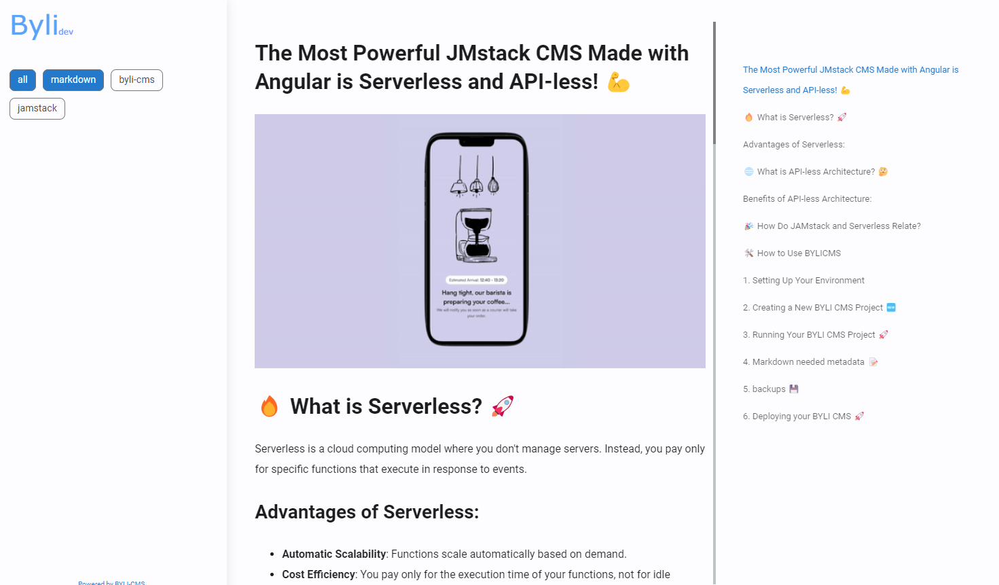
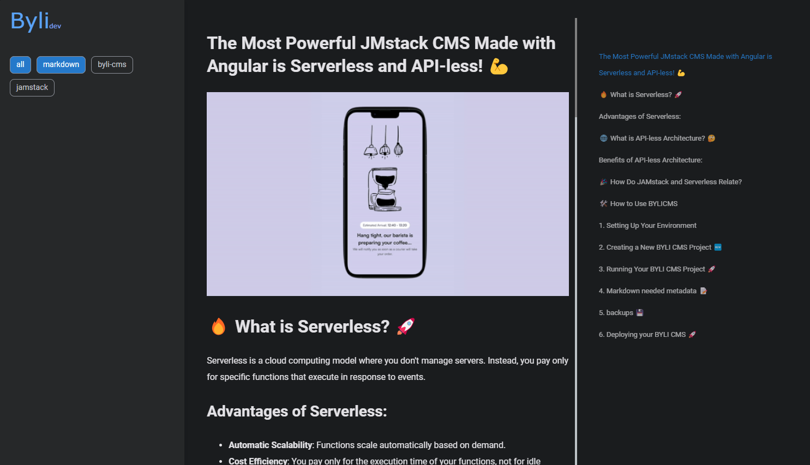

## The Most Powerful JMstack CMS Made with Angular is Serverless and API-less! 💪


## 🔥 **What is Serverless?** 🚀

Serverless is a cloud computing model where you don't manage servers. Instead, you pay only for specific functions that
execute in response to events.

### **Advantages of Serverless:**

- **Automatic Scalability**: Functions scale automatically based on demand.
- **Cost Efficiency**: You pay only for the execution time of your functions, not for idle servers.
- **Less Maintenance**: No need to worry about server infrastructure maintenance.

## 🌐 **What is API-less Architecture?** 🤔

API-less architecture focuses on building applications without directly interacting with APIs for every piece of
functionality. Instead, it may rely on static data or built-in functions and services. This can simplify development and
reduce dependencies on external systems.

### **Benefits of API-less Architecture:**

- **Simpler Development**: Fewer dependencies and reduced complexity.
- **Faster Execution**: Eliminates the need for API calls, which can speed up performance.
- **Reduced Costs**: Fewer external services may mean lower operational costs.

## 🎉 **How Do JAMstack and Serverless Relate?**

JAMstack and Serverless complement each other perfectly. While JAMstack focuses on a modern, fast frontend architecture,
Serverless handles backend logic seamlessly without the need for server management. Together, they provide a robust and
efficient solution for building web applications and sites.

## Why BYLI CMS? 🤔
BYLI CMS is a powerful JAMstack CMS made with Angular +18 and provides you with :
- **Serverless**: You don't need to worry about servers. Just deploy your Angular static /dist folder
- **API-less**: You don't need to worry about APIs. Just write your content in markdown files and it will be indexed by the CMS
- **Image Optimization**: BYLI CMS provides you with image optimization
- **SCSS compatibility**: BYLI CMS provides you with SCSS compatibility
- **Material M3 themes**: BYLI CMS provides you with Material M3 themes (light and dark)
- **Spy menu**: BYLI CMS provides you with a spy menu while scrolling.
- **SEO**: BYLI CMS provides you with SEO metadata and tags for your articles
- **Tags**: BYLI CMS provides you with tags for your articles
- **Author**: BYLI CMS provides you with the author of the article
- **Date**: BYLI CMS provides you with the date of the article
- **Thumbnails**: BYLI CMS provides you with thumbnails for your articles
- **Routing**: BYLI CMS provides you with routing for your articles
- **Angular**: BYLI CMS is made with Angular, so you can extend it as you want
- **Markdown**: BYLI CMS uses markdown files for your content
- **Backup**: BYLI CMS provides you with a backup of your content
- **Deploy**: BYLI CMS provides you with a workflow for deploying your Angular app to github pages

## Themes 🎨
BYLI CMS provides you with Material M3 themes (light and dark). You can change the theme in the `src/styles.scss` file.
```scss
$theme: $light-theme;
// $theme: $dark-theme;
```
## Light Theme example


## Dark Theme example


## 🛠️ **How to Use BYLICMS**

### **1. Setting Up Your Environment**

Before you start, ensure you have Node.js and npm installed.

```bash
# install byli cli globally
npm install byli@^1.0.4 -g
```

### **2. Creating a New BYLI CMS Project 🆕**

```bash
byli init
# if you have problems with the installation, try with 
npm exec byli init
# if you still having problems try with 
git clone git@github.com:bylidev/byli-blog.git
```
Now you will see the following directory structure:

```bash
-- cms
    |-- app
    |-- cms
    |---- images
    |---- *.md
-- app
    |-- src
    |-- package.json
    |-- angular.json
    |-- ...
```
To this point, you have created a new BYLI CMS project with the default structure. You can now start adding your content to the `cms` directory, and refreshing the app with `byli refresh`.


### **3. Running Your BYLI CMS Project 🚀**

```bash
cd ./app
npm install
ng serve
```

### **4. Markdown needed metadata 📝**
When creating a new markdown file, you need to add the following metadata at the beginning of the file:

```markdown
---
title: "BYLICMS - The Most Powerful JAMstack CMS Made with Angular is Serverless and API-less!"
author: "Ignacio Lopez"
route: "abstract-factory"
thumb: "caffee.gif"
date: "2024-07-20"
tags:
  - markdown
---
```
- title: The title of the article. 📚
- author: The author of the article. ✍️
- route: The Angular route of the article. 🌐
- thumb: The thumbnail of the article (this image will be resized). 🖼️
- date: The date of the article (important for sorting). 📅
- tags: Tags of the article (important for generating tags and SEO metadata). 🏷️

### 5. backups  💾
You only need to backup the `cms` directory, as it contains all your content. The `app` directory is your Angular project, and you can always recreate it with `byli init`.

### 6. Deploying your BYLI CMS 🚀
You can deploy your BYLI CMS to any static hosting provider, like gitlab pages, github pages, cloudflare pages. Just build your Angular app and deploy the `dist` directory.
byli cms, provides you a configured workflow for github pages.

#### [View on GitHub](https://github.com/bylidev/byli-cms)