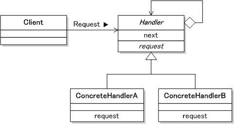
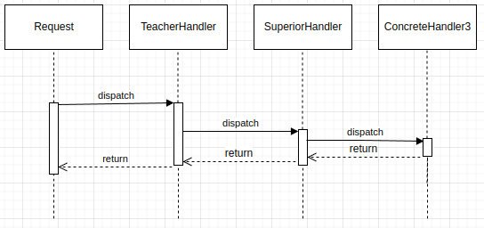

# Chain of responsability pattern

 __Avoid coupling the sender of a request to its receiver by giving more than one object the chance to handle the request. Chain the receiving objects and pass the request along the chain until an object handles it.__

## Where and When Chain of Responsibility pattern is applicable ?

-   When you want to decouple a request’s sender and receiver
-   Multiple objects, determined at runtime, are candidates to handle a request
-   When you don’t want to specify handlers explicitly in your code
-   When you want to issue a request to one of several objects without specifying the receiver explicitly.

### Class Diagram

### Example

[school request example](https://stackblitz.com/edit/typescript-fktrnv?file=index.ts)
