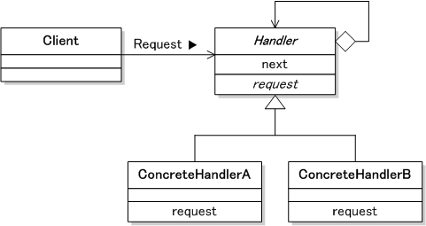
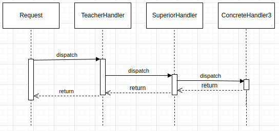

# Chain of Responsibility Pattern

> **Intent:** Avoid coupling the sender of a request to its receiver by giving more than one object the chance to handle the request. Chain the receiving objects and pass the request along the chain until an object handles it.

The Chain of Responsibility pattern is a **behavioral design pattern** that lets you pass requests along a chain of handlers. Upon receiving a request, each handler decides either to process the request or to pass it to the next handler in the chain.

---

## When to Use the Chain of Responsibility Pattern

This pattern is applicable when:

- You want to **decouple a request's sender and receiver**
- **Multiple objects**, determined at runtime, are candidates to handle a request
- You don't want to specify handlers explicitly in your code
- You want to issue a request to one of several objects **without specifying the receiver explicitly**
- The set of objects that can handle a request should be specified dynamically

---

## Structure

### Class Diagram



The diagram shows the key roles:

| Role | Responsibility |
|------|---------------|
| **Handler** | Declares the interface for handling requests; optionally holds a reference to the next handler |
| **ConcreteHandler** | Handles requests it is responsible for; can access the next object in the chain |
| **Client** | Initiates the request to a ConcreteHandler object on the chain |

---

## Real-World Analogies

The Chain of Responsibility is present in many everyday scenarios:

| Scenario | Chain |
|----------|-------|
| **Customer support** | Level 1 agent → Level 2 agent → Manager → Engineering |
| **Corporate approvals** | Employee → Team Lead → Director → CEO |
| **Web middleware** | Auth middleware → Logging → Rate limiting → Route handler |
| **ATM cash dispensing** | $100 bills → $50 bills → $20 bills → $10 bills |

---

## Example

### Class Diagram Example



### Code Example (TypeScript)

```typescript
abstract class Handler {
  private nextHandler: Handler | null = null;

  setNext(handler: Handler): Handler {
    this.nextHandler = handler;
    return handler;
  }

  handle(request: number): string | null {
    if (this.nextHandler) {
      return this.nextHandler.handle(request);
    }
    return null;
  }
}

class LevelOneSupport extends Handler {
  handle(request: number): string | null {
    if (request <= 1) {
      return `Level 1 Support handled request ${request}`;
    }
    return super.handle(request);
  }
}

class LevelTwoSupport extends Handler {
  handle(request: number): string | null {
    if (request <= 2) {
      return `Level 2 Support handled request ${request}`;
    }
    return super.handle(request);
  }
}

class Manager extends Handler {
  handle(request: number): string | null {
    return `Manager handled request ${request}`;
  }
}

// Build the chain
const level1 = new LevelOneSupport();
const level2 = new LevelTwoSupport();
const manager = new Manager();

level1.setNext(level2).setNext(manager);

// Client sends requests
console.log(level1.handle(1)); // Level 1 Support handled request 1
console.log(level1.handle(2)); // Level 2 Support handled request 2
console.log(level1.handle(3)); // Manager handled request 3
```

[🔗 School request example on StackBlitz](https://stackblitz.com/edit/typescript-fktrnv?file=index.ts)

---

## Benefits and Trade-offs

| ✅ Benefits | ⚠️ Trade-offs |
|------------|--------------|
| Reduces coupling between sender and receivers | Request may go unhandled if chain is misconfigured |
| Single Responsibility — each handler does one thing | Can be hard to debug and trace the flow |
| Open/Closed — add new handlers without changing existing code | Performance overhead if chain is very long |
| Flexible ordering of handlers at runtime | Order of handlers matters and must be carefully managed |

---

## Related Patterns

- **Command** — can be used together; commands are dispatched through a chain
- **Decorator** — similar structure but focused on enhancing behavior, not routing requests
- **Composite** — handlers can sometimes be composites themselves
