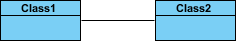
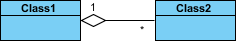
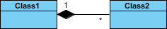
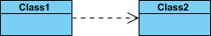
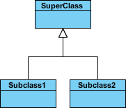
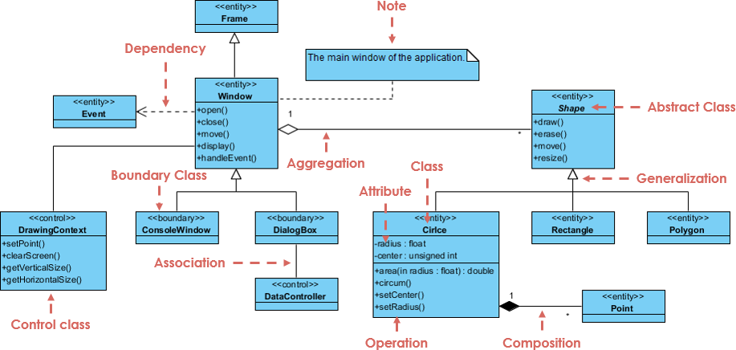

# Class Diagrams

Class diagrams are a cornerstone of object-oriented design. They provide a **visual blueprint** of a system's structure — describing classes, their attributes, methods, and most importantly, how they **relate to each other**. They are an essential tool for representing, documenting, and communicating design patterns.

> 💡 Before diving into design patterns, mastering class diagram relationships is crucial — every pattern is best understood through its structural diagram.

---

## Key Relationships

### Association

**Association** represents a general relationship where one class interacts with or uses another. It's the most basic form of relationship — it simply means that instances of one class are connected to instances of another.

- **Example:** A `Customer` is associated with an `Order`
- Typically depicted as a plain arrow
- Can be unidirectional or bidirectional

---

### Aggregation

**Aggregation** is a *"has-a"* relationship where one class contains or uses another, but the contained class can exist independently. The lifecycle of the child is **not** controlled by the parent.

- **Example:** A `Department` aggregates `Employee` objects — employees can exist without the department
- Depicted with a hollow diamond on the parent side

---

### Composition

**Composition** is a stronger form of aggregation — a *"owns-a"* relationship. The child object **cannot exist** independently of the parent. If the parent is destroyed, the children are too.

- **Example:** A `House` is composed of `Room` objects — rooms don't exist without the house
- Depicted with a filled diamond on the parent side

---

### Dependency

**Dependency** indicates that one class **uses** another, typically as a method parameter, local variable, or return type. It's the weakest relationship — a change in the used class may affect the dependent one.

- **Example:** A `ReportGenerator` depends on a `PrintService`
- Depicted as a dashed arrow

---

### Inheritance (Generalization)

**Inheritance** (or generalization) is the *"is-a"* relationship. A subclass inherits the attributes and behaviors of a superclass, extending or overriding them as needed.

- **Example:** `Dog` inherits from `Animal`
- Depicted with a hollow triangle arrowhead pointing to the superclass

---

## Quick Reference: Choosing the Right Relationship

| Relationship | Keyword | Lifecycle Dependency | UML Symbol |
|---|---|---|---|
| **Association** | uses / interacts | Independent | Plain arrow `→` |
| **Aggregation** | has-a | Independent | Hollow diamond `◇→` |
| **Composition** | owns-a | Child depends on parent | Filled diamond `◆→` |
| **Dependency** | uses temporarily | Independent | Dashed arrow `-->` |
| **Inheritance** | is-a | N/A | Hollow triangle `△` |

---

## Analyzing a Real Diagram

Let's walk through a complete example diagram step by step:

1. **`Shape` is an abstract class** — indicated by italic font style. Abstract classes cannot be instantiated directly.
2. **Inheritance** — `Circle`, `Rectangle`, and `Polygon` all derive from `Shape`. Each is a specific type of Shape (generalization relationship).
3. **Association** — there is an association between `DialogBox` and `DataController`, meaning they interact with each other.
4. **Aggregation** — `Shape` is part of `Window`. Shape can exist independently of Window (hollow diamond).
5. **Composition** — `Point` is part of `Circle`. A Point cannot exist without a Circle (filled diamond).
6. **Dependency** — `Window` depends on `Event`, but `Event` does not depend on `Window`.
7. **Attributes** — `Circle` has attributes `radius` (float) and `center` (Point).
8. **Methods** — `Circle` exposes `area()`, `circum()`, `setCenter()`, and `setRadius()`.
9. **Parameters** — `radius` in `Circle` is an input parameter of type `float`.
10. **Return types** — `area()` returns a value of type `double`.
11. **Hidden members** — Some attributes and methods of `Rectangle` and other classes are collapsed for brevity.

---

## Practical Tips

- Use **composition** when the child's existence is meaningless without the parent
- Prefer **aggregation** when the contained objects are reusable across multiple parents
- Keep **dependencies** minimal — too many dashed arrows signal high coupling
- **Inheritance** should model true "is-a" relationships; avoid using it just for code reuse (prefer composition instead)
- Always label relationships when the direction or multiplicity isn't obvious

---

## Why Class Diagrams Matter

Understanding class diagrams unlocks the ability to:

- 📐 **Communicate design** clearly with teammates before writing code
- 🔍 **Reverse-engineer** existing systems for documentation
- 🧩 **Recognize design patterns** instantly from their structural signatures
- 🛡️ **Spot design smells** like tight coupling or wrong lifecycle management
