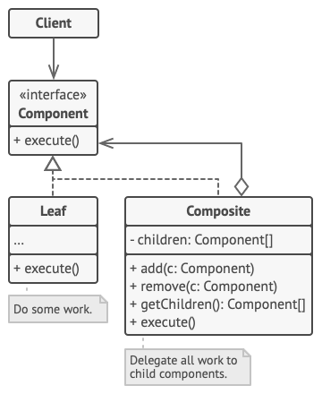
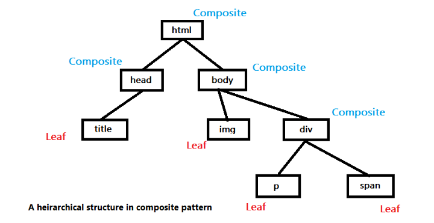

# Composite Pattern: Building Tree-like Structures

The Composite pattern is a **structural design pattern** that lets you compose objects into tree structures to represent **part-whole hierarchies**. It allows clients to treat individual objects (leaves) and compositions of objects (containers) uniformly through a common interface.

> **Core idea:** A container doesn't need to know the concrete types of its children. It interacts with all sub-elements through a shared component interface — delegating work down the tree and aggregating results back up.

---

## Understanding the Composite Pattern

The tree is made of two types of nodes:

- **Leaf** — A basic element with no children. It does the actual work and implements the component interface directly.
- **Composite (Container)** — An element that can hold other elements (leaves or other composites). It delegates work to its children, processes intermediate results, and returns the final result to the caller.

The key insight: **both types implement the same interface**, so the client doesn't distinguish between them.

---

## Structure



### Components

| Role | Responsibility |
|------|---------------|
| **Component** (interface) | Declares the shared interface for both leaves and composites |
| **Leaf** | Implements the component interface; has no children; performs actual work |
| **Composite** | Stores child components; implements interface by delegating to children |
| **Client** | Works with all elements through the component interface |

---

## Implementation: File System Example

A file system is one of the most intuitive examples of the Composite pattern — directories are composites, files are leaves.

```typescript
// Component interface
interface FileSystemItem {
  getName(): string;
  getSize(): number;
  print(indent?: string): void;
}

// Leaf
class File implements FileSystemItem {
  constructor(private name: string, private size: number) {}

  getName(): string { return this.name; }
  getSize(): number { return this.size; }
  print(indent = ''): void {
    console.log(`${indent}📄 ${this.name} (${this.size} KB)`);
  }
}

// Composite
class Directory implements FileSystemItem {
  private children: FileSystemItem[] = [];

  constructor(private name: string) {}

  add(item: FileSystemItem): void { this.children.push(item); }
  remove(item: FileSystemItem): void {
    this.children = this.children.filter(c => c !== item);
  }

  getName(): string { return this.name; }
  getSize(): number { return this.children.reduce((sum, c) => sum + c.getSize(), 0); }
  print(indent = ''): void {
    console.log(`${indent}📁 ${this.name}/`);
    this.children.forEach(c => c.print(indent + '  '));
  }
}

// Client code — treats files and directories identically
const root = new Directory('root');
const src = new Directory('src');
src.add(new File('index.ts', 10));
src.add(new File('app.ts', 25));
root.add(src);
root.add(new File('README.md', 5));

root.print();
// 📁 root/
//   📁 src/
//     📄 index.ts (10 KB)
//     📄 app.ts (25 KB)
//   📄 README.md (5 KB)

console.log(`Total size: ${root.getSize()} KB`); // Total size: 40 KB
```

---

## Real-World Example: DOM Tree

A common real-world application of the Composite pattern is the **Document Object Model (DOM)** in web development. HTML elements form a hierarchical tree structure:

- **Composite nodes:** `<div>`, `<section>`, `<ul>` — can contain other elements
- **Leaf nodes:** ``, `<input>`, text nodes — have no children

The DOM API provides a unified interface (`Node`, `Element`) to interact with all node types, making it trivial to traverse, query, or manipulate the entire document tree without knowing the concrete type of each node.



---

## Other Real-World Use Cases

| Domain | Composite (Container) | Leaf |
|--------|----------------------|------|
| **File System** | Directory | File |
| **UI Components** | Panel, Window, Form | Button, Label, Input |
| **Organization Chart** | Manager, Department | Individual Contributor |
| **Menu System** | Menu, Submenu | MenuItem |
| **Expression Trees** | Binary operator (+, *) | Number, Variable |

---

## Benefits and Trade-offs

| ✅ Benefits | ⚠️ Trade-offs |
|------------|--------------|
| Treat individual objects and compositions uniformly | Can make design overly general — hard to restrict what can be added to a composite |
| Add new component types without breaking existing code (Open/Closed Principle) | Difficult to enforce constraints on the tree structure at compile time |
| Recursive operations become natural and clean | Deep trees can have performance implications |
| Simplifies client code — no type checking needed | May require runtime type checks if you need leaf-only or composite-only operations |

---

## Composite vs. Similar Patterns

| Pattern | Purpose | Key Difference |
|---------|---------|---------------|
| **Composite** | Build part-whole hierarchies | Both leaves and composites share an interface |
| **Decorator** | Add behavior to objects | Wraps a single object; doesn't form a tree |
| **Iterator** | Traverse a collection | Focused on traversal, not structure |

---

## Conclusion

The Composite pattern excels whenever you work with **recursive tree structures** where individual elements and groups of elements need to be treated identically. Its uniformity eliminates type-checking boilerplate and makes hierarchical systems like file systems, UI component trees, or organization charts elegant to implement and extend.

By programming to the component interface rather than concrete types, your client code remains clean, simple, and fully decoupled from the underlying tree structure.
