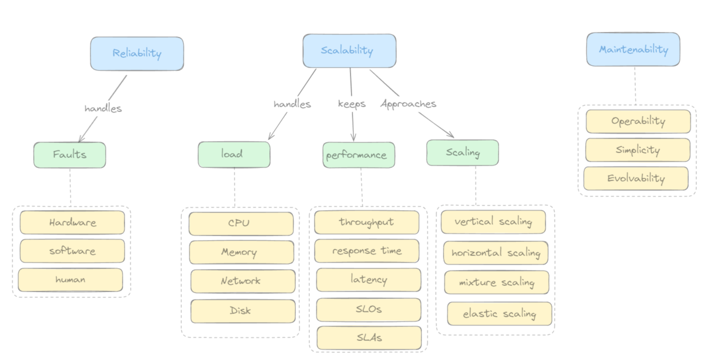

# Reliability, Scalability & Maintainability

When designing data-intensive applications, three fundamental properties determine whether a system will hold up in production. These are not abstract ideals — they are practical engineering goals that shape every architectural decision you make.

---

## Reliability

**Reliability** is the ability of a system to work correctly even when things go wrong. A reliable system continues to deliver the correct functionality at the desired level of performance, even when facing hardware failures, software bugs, or human errors.

The things that can go wrong are called **faults**, and systems designed to anticipate and recover from them are called **fault-tolerant** or **resilient**.

> ⚠️ Note: A *fault* is not the same as a *failure*. A fault is when one component deviates from its specification; a failure is when the system as a whole stops providing the required service. The goal is to prevent faults from causing failures.

### Types of Faults

| Fault Type | Description | Examples |
|---|---|---|
| **Hardware errors** | Physical component failures | Hard disk crash, RAM corruption, power outage, network switch failure |
| **Software errors** | Bugs in code or unexpected edge cases | Unhandled exceptions, memory leaks, cascading failures across services |
| **Human errors** | Mistakes made by operators or developers | Misconfiguration, deploying untested changes, accidental data deletion |

### Building Reliable Systems

- Design for **graceful degradation** — degrade functionality rather than failing completely
- Use **redundancy** at every layer (disks, servers, network links, datacenters)
- Implement **chaos engineering** — deliberately introduce faults to test resilience
- Enforce **staged rollouts** and **feature flags** to limit blast radius of changes
- Write **comprehensive monitoring and alerting** to detect problems early

---

## Scalability

**Scalability** is the capacity to add computing resources to handle additional load while maintaining acceptable performance as the system grows — in terms of users, requests per second, data volume, or complexity.

### Load Parameters

Load parameters are the metrics you use to describe how much demand your system is handling. Choosing the right load parameters is critical for meaningful capacity planning.

| Load Parameter | Description | Typical Units |
|---|---|---|
| **CPU Load** | How much processing work the CPU is doing | Percentage, load average |
| **Memory Load** | RAM utilization across the system | GB used, percentage |
| **Network Load** | Volume of data in and out of the system | Requests/sec, Mbps, packet rate |
| **Disk Load** | Read/write operations on storage | IOPS, MB/s, queue depth |
| **Active Users** | Concurrent users interacting with the system | Users, sessions |
| **Requests per Second** | Rate of incoming API or database queries | RPS, QPS |

Monitoring these parameters is crucial for identifying bottlenecks before they cause incidents.

---

### Performance

Once you have defined load parameters, you can ask the key scalability questions:

1. **If load increases, how does performance change** — assuming you keep resources (CPU, memory, bandwidth) constant?
2. **If load increases, how much must you increase resources** to keep performance constant?

To answer these, you need concrete performance metrics.

#### Throughput

The amount of work a system can process per unit of time.

- **Batch systems:** records processed per second, or total time to process a dataset
- **Online systems:** requests handled per second (RPS / QPS)

#### Response Time

The total time elapsed between when a client sends a request and when it receives a complete response. It includes:

- **Service time** — processing the request
- **Network latency** — data travel time
- **Queue time** — waiting behind other requests

> Response time should never be thought of as a single number. It is a **distribution** — run the same request repeatedly and you'll get slightly different values each time. Use percentiles, not averages.

#### Response Time Percentiles

| Percentile | Meaning | Example |
|---|---|---|
| **P50 (median)** | Half of requests are faster than this | p50 = 65ms → 50% of requests finish in under 65ms |
| **P90** | 90% of requests are faster than this | p90 = 125ms → only 10% take longer |
| **P95** | 95% of requests are faster than this | p95 = 160ms → only 5% take longer |
| **P99** | 99% of requests are faster than this | p99 = 400ms → only 1% take longer |
| **P99.9 ("three nines")** | Captures the worst outliers | Critical for SLA compliance |

> 💡 High percentiles (p95, p99) matter more than averages. A slow p99 means your best customers — the ones making the most requests — experience the worst performance.

#### Latency vs. Response Time

These terms are often confused:

- **Latency** is the time data takes to travel between two points over the network — pure transport delay, excluding processing
- **Response time** is latency + service time + queue time — everything from the client's perspective

#### SLOs — Service Level Objectives

**SLOs** are internal performance targets that define what "good" looks like for your service:
- "p99 response time < 200ms"
- "availability > 99.9%"
- "error rate < 0.1%"

SLOs are the engineering targets your team monitors and builds to.

#### SLAs — Service Level Agreements

**SLAs** are contractual commitments made to customers. They formalize SLOs with consequences — typically financial penalties (credits, refunds) if targets are missed.

| | SLO | SLA |
|---|---|---|
| **Audience** | Internal team | External customers |
| **Nature** | Engineering target | Legal contract |
| **Consequence of breach** | Alerts, on-call pages | Financial penalties, customer churn |

---

## Maintainability

A system's majority of its cost lies not in initial development, but in **ongoing maintenance** — fixing bugs, adapting to new requirements, adding features, and onboarding new engineers. Good maintainability minimizes this cost over time.

Three design principles drive maintainability:

### 1. Operability

Make it easy for operations teams to keep the system running smoothly.

- **Monitor** system health continuously and restore service quickly when issues arise
- **Track down** the root cause of failures and degraded performance with good observability
- **Automate** routine tasks: deployments, backups, failover
- **Keep software up to date** — including security patches
- **Document** operational procedures so any team member can act in an incident
- **Predict problems** before they occur through capacity planning and trending

### 2. Simplicity

Manage complexity so the system remains understandable as it grows.

- Complexity is the root cause of most maintenance pain — it makes bugs harder to find and changes harder to make safely
- Use good **abstractions** to hide implementation details behind clean interfaces (see the [Facade pattern](https://byli.dev/facade))
- Avoid **accidental complexity** — complexity that comes from implementation choices rather than the inherent problem domain
- Keep modules **cohesive** and **loosely coupled**

### 3. Evolvability (Extensibility)

Make it easy to change the system in the future as requirements evolve.

- Design so components can be **replaced or upgraded independently**
- Use well-defined **contracts between services** (APIs, schemas, events)
- Follow **Agile** and **iterative** development practices to respond to change
- Write tests that protect correctness while allowing internal refactoring

---

## Summary

| Property | Core Question | Key Techniques |
|---|---|---|
| **Reliability** | Does it work correctly when things fail? | Redundancy, fault isolation, chaos testing |
| **Scalability** | Can it handle growth without degrading? | Load measurement, percentile monitoring, horizontal scaling |
| **Maintainability** | Can the team keep it running and evolving? | Operability, simplicity, evolvability |

These three properties are not independent. A system that is not reliable will not be trusted enough to scale. A system that cannot be maintained will accumulate complexity until it becomes unreliable. Designing with all three in mind from the start is the foundation of data-intensive application architecture.

In the next posts in this series, we'll go deeper into each topic — exploring storage engines, replication, partitioning, and distributed system trade-offs.
