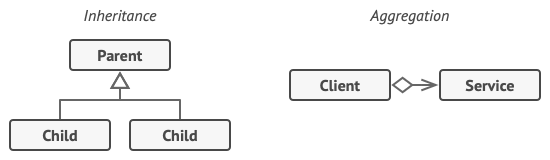
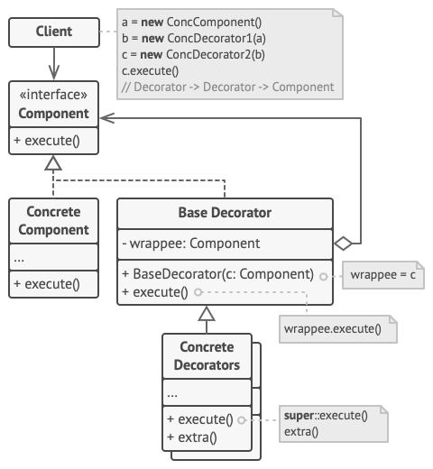
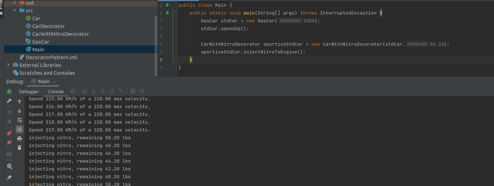

# Decorator Pattern: Adding Flexible Behaviors to Objects

The Decorator pattern is a **structural design pattern** that lets you attach new behaviors to objects at runtime by wrapping them inside special decorator objects. It provides a flexible alternative to subclassing for extending functionality.

> **Core principle:** Favor composition over inheritance. Instead of extending classes, decorators wrap objects — allowing behavior to be added, combined, or removed dynamically without touching existing code.

---

## The Problem It Solves

Traditional inheritance leads to a predictable set of problems when extending object behavior:

- **Class explosion**: every combination of features requires its own subclass  
  (`CarWithNitro`, `CarWithNitroAndTurbo`, `CarWithTurboAndAWD`...)
- **Rigid hierarchies**: adding a new feature means modifying or extending the entire inheritance chain
- **Compile-time coupling**: behavior is locked in at compile time, making runtime customization impossible

The Decorator pattern solves all three by composing behavior in layers at runtime.

---

## How It Works



Decorators implement the **same interface** as the component they wrap. This allows them to be used interchangeably with the original object while transparently adding behavior before or after delegating to the wrapped object.

The call chain flows like this:

```
Client → Decorator B → Decorator A → Core Component
```

Each decorator calls the same method on the next object in line, adding its own logic before or after.

---

## Structure



| Role | Responsibility |
|---|---|
| `Component` (interface) | Defines the contract that both concrete components and decorators implement |
| `ConcreteComponent` | The base object being decorated — has no knowledge of decorators |
| `BaseDecorator` | Wraps a `Component` and delegates calls to it; defines the decorator structure |
| `ConcreteDecorator` | Extends `BaseDecorator` to add specific behavior before or after delegation |

---

## Example: Enhancing a Car at Runtime



Consider a gasoline-powered car that we want to equip with optional performance upgrades. Since a `Car` is often a final, production-grade class you cannot modify, the Decorator pattern lets you inject new capabilities cleanly:

```typescript
// Component interface
interface Car {
  accelerate(): void;
  describe(): string;
}

// Concrete Component
class GasolineCar implements Car {
  accelerate(): void { console.log('Accelerating with gasoline engine'); }
  describe(): string { return 'Gasoline Car'; }
}

// Base Decorator
abstract class CarDecorator implements Car {
  constructor(protected wrappedCar: Car) {}
  accelerate(): void { this.wrappedCar.accelerate(); }
  describe(): string { return this.wrappedCar.describe(); }
}

// Concrete Decorators
class NitroDecorator extends CarDecorator {
  accelerate(): void {
    super.accelerate();
    console.log('Injecting nitro boost! 🚀');
  }
  describe(): string { return `${super.describe()} + Nitro`; }
}

class TurboDecorator extends CarDecorator {
  accelerate(): void {
    super.accelerate();
    console.log('Turbo charger spinning up! ⚡');
  }
  describe(): string { return `${super.describe()} + Turbo`; }
}

class AWDDecorator extends CarDecorator {
  accelerate(): void {
    super.accelerate();
    console.log('All four wheels engaged! 🔧');
  }
  describe(): string { return `${super.describe()} + AWD`; }
}

// Stack decorators — any combination, any order
const myCar = new NitroDecorator(new TurboDecorator(new AWDDecorator(new GasolineCar())));
myCar.accelerate();
console.log(myCar.describe());
// Gasoline Car + AWD + Turbo + Nitro

// Or just one enhancement
const simpleCar = new NitroDecorator(new GasolineCar());
simpleCar.accelerate();
```

---

## Real-World Applications

| Domain | Example |
|--------|---------|
| **Java I/O** | `new GZIPInputStream(new BufferedInputStream(new FileInputStream(...)))` |
| **HTTP Middleware** | Authentication → Logging → Rate-limiting → Route handler |
| **Caching** | Wrap a repository to add transparent cache lookup before hitting the DB |
| **Logging** | Wrap a service to trace inputs/outputs without modifying the service |
| **UI Components** | Add borders, shadows, or scrolling behavior to visual components |
| **Security** | Wrap API clients with token refresh, retry, and error translation logic |

---

## Benefits and Trade-offs

| ✅ Benefits | ⚠️ Trade-offs |
|------------|--------------|
| Open/Closed Principle — extend behavior without modifying existing classes | Deep chains can make stack traces harder to follow |
| Single Responsibility — each decorator handles exactly one concern | Large interfaces force decorators to implement every method |
| Runtime flexibility — add or remove decorators dynamically | Order of decorators matters and must be managed carefully |
| Composability — stack multiple decorators in any order | Can result in many small classes that are hard to navigate individually |

---

## Decorator vs. Inheritance

| Aspect | Inheritance | Decorator |
|--------|------------|-----------|
| **Timing** | Compile time | Runtime |
| **Combinations** | Requires a new class per combo | Any combination via stacking |
| **Modification needed** | Must modify/extend class hierarchy | Wrap without touching originals |
| **Flexibility** | Low | High |

---

## When to Use It

✅ Use the Decorator pattern when:
- You need to add behavior to individual objects without affecting others of the same class
- Subclassing leads to a combinatorial explosion of classes
- You need to combine behaviors in different ways at runtime
- The class you want to extend is `final` or outside your control

---

## Conclusion

The Decorator pattern keeps behavior additions isolated, composable, and reversible. Whether you're layering middleware, building I/O pipelines, or adding optional features to domain objects, it provides a clean, maintainable alternative to inheritance-heavy designs.

For a practical implementation, explore the [GitHub example](https://github.com/igloar96/byli-decorator), which demonstrates how to build and compose decorators step by step.
