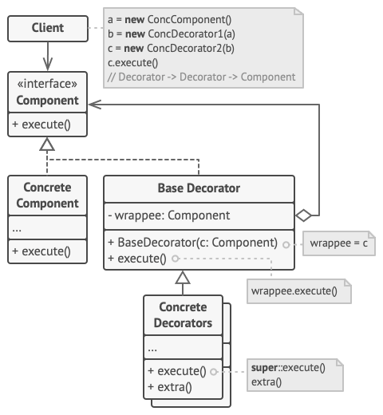
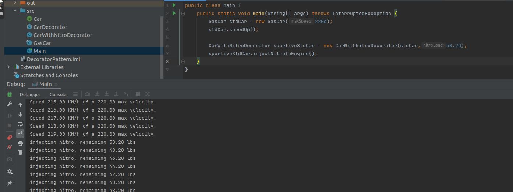

# Decorator Pattern: Adding Flexible Behaviors to Objects

The Decorator pattern allows you to dynamically add extra behaviors to objects at runtime without altering the existing code that uses these objects. It provides a flexible and maintainable way to extend the functionality of objects without resorting to excessive inheritance.

## Understanding the Decorator Pattern

When faced with a scenario where traditional inheritance might lead to a class explosion or tightly coupled classes, the Decorator pattern comes to the rescue. It follows the principle of composition over inheritance, where objects can be decorated with additional functionalities by aggregating or composing them at runtime.

## Class Diagram

A class diagram is a visual representation that describes how classes are related to each other in an application. It is a crucial tool in understanding and depicting different design patterns. Before we delve into the world of design patterns, let's take a moment to familiarize ourselves with class diagrams.

## Example Use Case

Consider a gasoline-powered car that we want to equip with nitro to enhance its performance. Since a car is typically a "final" product, extending the car class directly is not a feasible option. Instead, we can use the Decorator pattern to add customization without modifying the original car class. By creating a wrapper or a decorator, we can inject the nitro functionality at runtime.

## Implementation Details

The Decorator pattern allows objects to delegate tasks to another linked "helper" object, or in some cases, multiple objects. This way, we can easily substitute or combine different behaviors, changing the object's behavior at runtime.

## Benefits of the Decorator Pattern

The Decorator pattern brings several advantages to the table:

-   **Dynamic Behavior**: With the Decorator pattern, you can easily modify an object's behavior by adding or removing decorators at runtime.
-   **Maintainable Code**: It promotes composition over inheritance, resulting in a more maintainable and extensible codebase.
-   **Reusable Components**: Decorators can be reused and combined in various ways to create different combinations of behaviors.

## Conclusion

The Decorator pattern is a valuable design pattern for adding flexible behaviors to objects at runtime. By embracing composition and delegation, it allows for dynamic customization without the need for excessive inheritance or modification of existing code.

In our example, injecting nitro into the car's engine showcased how the Decorator pattern can enhance the capabilities of an object while keeping the codebase clean and maintainable.

For a practical implementation of the Decorator pattern, you can explore the provided [GitHub example](https://github.com/igloar96/byli-decorator), which demonstrates how to extend objects with decorators to achieve desired functionalities.