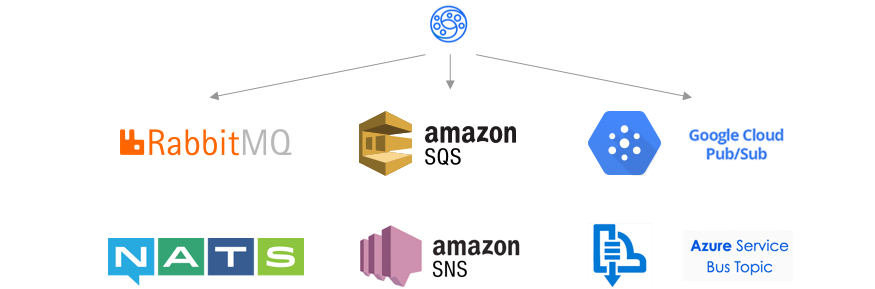

# Exploring Events: Use Cases, Event Types, Delivery Semantics, and Broker Technologies

Event-Driven Architecture (EDA) is a software design paradigm where the flow of the application is determined by **events** — discrete occurrences that signal a state change. Systems built on EDA are highly decoupled, scalable, and responsive, making them a cornerstone of modern distributed system design.

---

## Common Use Cases for Event-Driven Architecture

| Use Case | Description | Example |
|----------|-------------|---------|
| **Fire and Forget** | Emit an event and move on — no response needed | Sending a notification email or SMS after a user registers |
| **Reliable Delivery** | Every event must be processed; no data loss tolerated | Processing online payments where each transaction must be recorded |
| **Infinite Event Streams** | Continuous, unbounded flow of events over time | Monitoring sensor data in a smart home (temperature, humidity, motion) |
| **Anomaly Detection** | Identify unusual patterns across streams of events | Fraud detection in financial transactions |
| **Broadcasting** | One event, many consumers receive it simultaneously | Live streaming sports events to thousands of subscribers |
| **Buffering** | Absorb bursts of events before downstream processing | Aggregating log data from many services before sending to a central store |

---

## Event Types

### Pub/Sub Events
Events are **delivered to each subscriber starting at the moment of subscription**, with no guaranteed order or historical replay. If you weren't subscribed when the event was emitted, you missed it.

- **Best for:** Notifications, broadcasting, real-time reactions
- **Examples:** Google Cloud Pub/Sub, Amazon SNS, Redis Pub/Sub

### Streaming Events
Events are **stored in order** in a log and can be **replayed historically** from any point in time. Consumers track their own position (offset) in the stream.

- **Best for:** Audit logs, event sourcing, data pipelines, reprocessing
- **Examples:** Apache Kafka, Amazon Kinesis, Azure Event Hubs

---

## Delivery Semantics

Delivery semantics define the guarantee a messaging system makes about how events will be delivered. This is a critical architectural decision with real trade-offs.

### At-Most-Once

> **"Send it and forget it"**

- Data loss is **acceptable**
- No duplicate processing
- **Lowest latency and overhead** — no acknowledgment tracking needed
- **Example:** Sending promotional marketing emails. Missing a few emails is not critical — the system sends each once without confirming delivery.

### At-Least-Once

> **"Deliver it, even if it means duplicates"**

- Data loss is **unacceptable**
- Duplicate processing is **acceptable** (handled by consumers with idempotency)
- Increased latency due to acknowledgment and retry logic
- **Example:** Processing online orders. Each order must be recorded — it's better to process it twice (and deduplicate) than to miss it entirely.

### Exactly-Once

> **"Deliver it once and only once"**

- The most difficult guarantee to achieve
- Requires coordination between producer, broker, and consumer
- Highest latency
- **Example:** Transferring funds between bank accounts. A transaction must occur exactly once — overcharging or double-processing is unacceptable.

---

## Comparison of Delivery Semantics

| Semantic | Data Loss Risk | Duplicate Risk | Latency | Complexity |
|----------|---------------|----------------|---------|------------|
| **At-Most-Once** | High | None | Low | Low |
| **At-Least-Once** | None | High | Medium | Medium |
| **Exactly-Once** | None | None | High | Very High |

---

## Message Broker Technologies — Delivery Guarantees

| Broker | Producer Semantics | Consumer Semantics | Notes |
|--------|-------------------|-------------------|-------|
| **Apache Kafka** | At-Most-Once, At-Least-Once, Exactly-Once | At-Most-Once, At-Least-Once, Exactly-Once | Exactly-Once supported only when transferring between Kafka topics |
| **Amazon SQS Standard** | At-Least-Once | At-Least-Once | Messages may be delivered in any order, more than once |
| **Amazon SQS FIFO** | Exactly-Once (publishing) | Exactly-Once | Ordered, deduplication window of 5 minutes |
| **Google Cloud Pub/Sub** | At-Least-Once | Exactly-Once | With exactly-once delivery enabled |
| **Azure Event Hubs** | Exactly-Once (output) | — | Event Grid uses At-Least-Once with retry |
| **Azure Event Grid** | At-Least-Once | At-Least-Once | Built-in retry with exponential backoff |

---

## Choosing the Right Approach

Ask yourself:

1. **Can I afford to lose events?** → If no, rule out At-Most-Once
2. **Can my consumer handle duplicates safely (idempotency)?** → If yes, At-Least-Once is often sufficient and simpler
3. **Is strict exactly-once processing a hard requirement?** → Only then pay the cost of Exactly-Once semantics

> 💡 **Pro tip:** In practice, At-Least-Once + idempotent consumers is the most common and pragmatic architecture. True Exactly-Once is expensive to implement and maintain across system boundaries.

---

## Architectural Benefits of Event-Driven Architecture

- **Loose coupling** — producers and consumers are fully decoupled; neither knows about the other
- **Scalability** — consumers can scale independently based on event volume
- **Resilience** — events can be buffered and replayed if a consumer goes down
- **Auditability** — event logs provide a complete, replayable history of system state
- **Extensibility** — add new consumers to existing event streams without touching producers
