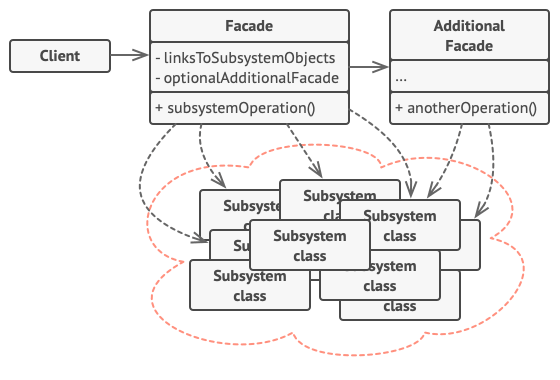
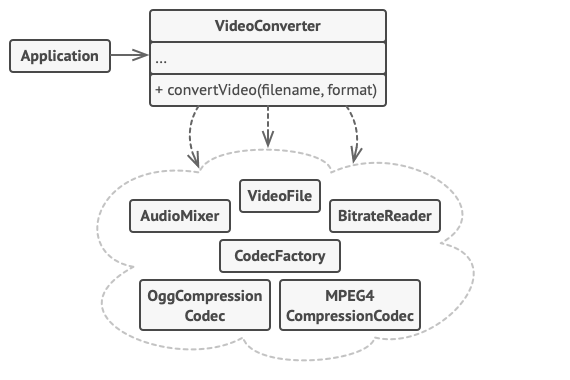

# Facade Pattern: Simplifying Complex Systems

The Facade pattern is a **structural design pattern** that provides a simplified, unified interface to a complex subsystem. It acts as a "front door" to a library, framework, or any complex set of classes — hiding the messy internals and presenting a clean surface to the outside world.

> **Real-world analogy:** When you turn on your computer, you press one button. You don't interact with the BIOS, the bootloader, memory initialization, driver loading, or the OS kernel startup sequence. A single action triggers a complex orchestration behind the scenes. That button is your facade.

---

## The Problem It Solves

Modern systems often involve complex subsystems with many interdependent classes. Working directly with these classes requires deep knowledge of their internals, their initialization order, and their dependencies.

**Without a Facade:**
- Client code is tightly coupled to multiple subsystem classes
- Changes in the subsystem ripple through all client code
- Subsystem logic is duplicated across different clients
- The cognitive load of using the subsystem is high

**With a Facade:**
- The client talks to a single, well-defined interface
- The subsystem is free to evolve without breaking clients
- Common use cases are pre-composed into simple methods

---

## Structure



| Component | Responsibility |
|---|---|
| **Facade** | Provides a simple interface to the subsystem; delegates requests to the appropriate subsystem objects |
| **Subsystem Classes** | Implement the actual complex logic; have no knowledge of the facade |
| **Client** | Uses only the facade — never calls subsystem classes directly |

---

## Example: Computer Startup Facade



```typescript
// Complex subsystem classes
class BIOS {
  initialize(): void { console.log('BIOS: Initializing hardware...'); }
  checkComponents(): void { console.log('BIOS: Running POST (Power-On Self-Test)...'); }
}

class MemoryManager {
  allocate(): void { console.log('Memory: Allocating system memory...'); }
}

class DriverLoader {
  loadDrivers(): void { console.log('Drivers: Loading device drivers...'); }
}

class OperatingSystem {
  boot(): void { console.log('OS: Booting kernel...'); }
  startUserSession(): void { console.log('OS: Starting user session...'); }
}

// Facade — the client only needs this
class ComputerFacade {
  private bios = new BIOS();
  private memory = new MemoryManager();
  private drivers = new DriverLoader();
  private os = new OperatingSystem();

  startComputer(): void {
    console.log('--- Computer starting up ---');
    this.bios.initialize();
    this.bios.checkComponents();
    this.memory.allocate();
    this.drivers.loadDrivers();
    this.os.boot();
    this.os.startUserSession();
    console.log('--- Ready to use ---');
  }

  shutDown(): void {
    console.log('Shutting down gracefully...');
    // Orchestrate the shutdown sequence internally
  }
}

// Client code — beautifully simple
const computer = new ComputerFacade();
computer.startComputer(); // One call instead of six
```

---

## Real-World Use Cases

| Domain | Complex Subsystem | Facade |
|--------|------------------|--------|
| **E-commerce** | Inventory, Payment, Shipping, Notifications | `OrderService.placeOrder(cart)` |
| **Video encoding** | Codec selection, compression, metadata, thumbnails | `VideoEncoder.encode(file, format)` |
| **Authentication** | Token generation, session management, permission check, audit log | `AuthFacade.login(credentials)` |
| **Databases** | Connection pooling, query building, transaction management | ORM `save()`, `find()` methods |
| **Home Automation** | Lights, thermostat, alarm, entertainment system | `HomeAutomation.leaveHome()` |

---

## Facade vs. Similar Patterns

| Pattern | Purpose | Key Difference |
|---------|---------|---------------|
| **Facade** | Simplify access to a complex subsystem | Provides a higher-level interface; subsystem is still accessible |
| **Adapter** | Convert an incompatible interface | Focuses on interface translation, not simplification |
| **Mediator** | Coordinate communication between objects | Objects communicate through the mediator rather than directly |
| **Proxy** | Control access to a single object | Controls a single object; Facade wraps an entire subsystem |

---

## Benefits and Trade-offs

| ✅ Benefits | ⚠️ Trade-offs |
|------------|--------------|
| Isolates clients from subsystem complexity | Can become a "god object" if it takes on too much responsibility |
| Reduces coupling between client and subsystem | May hide useful functionality that advanced users need |
| Subsystem evolves freely without breaking clients | Adds an extra layer of indirection |
| Promotes layered architecture — clear separation of concerns | |

---

## The "Dark Side" Principle

The name *Facade* comes from architecture — the decorative front of a building that hides the underlying structure. In software, a facade intentionally hides the **"dark side"** of a subsystem: its complexity, its quirks, its internal wiring.

> As developers, we should embrace the Facade pattern when dealing with intricate systems. By offering a simple interface to the outside world, we make our software more approachable, easier to maintain, and ultimately — a joy to work with.

---

## Conclusion

The Facade pattern is one of the most practical and immediately applicable patterns in software engineering. Any time you find yourself writing the same sequence of low-level calls repeatedly, or any time a subsystem has a steep learning curve, a well-designed facade can dramatically improve developer experience and reduce the surface area for bugs.
