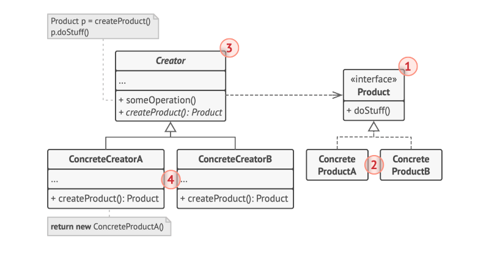

# Factory Method Pattern: Creating Objects Without Knowing Exact Types

The Factory Method pattern is a **creational design pattern** that defines an interface for creating an object but lets subclasses decide which class to instantiate. It encapsulates the object creation logic in a dedicated method, decoupling the client from the concrete types it needs to work with.

> **Core idea:** "Define an interface for creating an object, but let subclasses decide which class to instantiate. Factory Method lets a class defer instantiation to subclasses."  
> — Gang of Four

---

## The Problem It Solves

Without the Factory Method pattern, object creation is scattered across the codebase. Every time you need to create a `Button`, `Logger`, or `Transport`, you write `new ConcreteClass()` everywhere. This has consequences:

- **Tight coupling**: Client code depends on concrete classes
- **Low flexibility**: Swapping implementations requires modifying every creation site
- **Poor extensibility**: Adding a new product type requires changing existing code

The Factory Method moves creation logic to one place and makes it extensible via inheritance.

---

## Key Components



| Component | Responsibility |
|---|---|
| **Product** (interface) | Declares the interface common to all objects the factory can create |
| **ConcreteProduct** | Implements the Product interface for a specific type |
| **Creator** (abstract class) | Declares the factory method; may provide a default implementation or leave it abstract |
| **ConcreteCreator** | Overrides the factory method to return a specific ConcreteProduct |

---

## How It Works

1. The **Creator** defines an abstract `createProduct()` method (the factory method)
2. **ConcreteCreators** override this method to return specific product instances
3. The Creator's business logic calls `createProduct()` — it works with the Product interface, unaware of the concrete type
4. Adding new products = adding new ConcreteCreator subclasses — no existing code changes needed

---

## Code Example: Cross-Platform Notifications

```typescript
// Product interface
interface Notification {
  send(message: string): void;
  getChannel(): string;
}

// Concrete Products
class EmailNotification implements Notification {
  constructor(private email: string) {}
  send(message: string): void {
    console.log(`📧 Sending email to ${this.email}: "${message}"`);
  }
  getChannel(): string { return 'email'; }
}

class SMSNotification implements Notification {
  constructor(private phone: string) {}
  send(message: string): void {
    console.log(`📱 Sending SMS to ${this.phone}: "${message}"`);
  }
  getChannel(): string { return 'sms'; }
}

class SlackNotification implements Notification {
  constructor(private channel: string) {}
  send(message: string): void {
    console.log(`💬 Posting to Slack #${this.channel}: "${message}"`);
  }
  getChannel(): string { return 'slack'; }
}

// Creator — abstract class with the factory method
abstract class NotificationService {
  // Factory method — subclasses decide what to create
  abstract createNotification(): Notification;

  // Business logic uses the factory method internally
  notify(message: string): void {
    const notification = this.createNotification();
    console.log(`[${notification.getChannel().toUpperCase()}] Preparing notification...`);
    notification.send(message);
  }
}

// Concrete Creators
class EmailService extends NotificationService {
  constructor(private email: string) { super(); }
  createNotification(): Notification { return new EmailNotification(this.email); }
}

class SMSService extends NotificationService {
  constructor(private phone: string) { super(); }
  createNotification(): Notification { return new SMSNotification(this.phone); }
}

class SlackService extends NotificationService {
  constructor(private channel: string) { super(); }
  createNotification(): Notification { return new SlackNotification(this.channel); }
}

// Client — works only with the abstract Creator
function sendAlert(service: NotificationService, message: string): void {
  service.notify(message);
}

sendAlert(new EmailService('admin@example.com'), 'Server down!');
sendAlert(new SMSService('+1-555-0100'), 'Server down!');
sendAlert(new SlackService('alerts'), 'Server down!');
```

---

## Real-World Use Cases

| Domain | Factory Method | Concrete Implementations |
|--------|---------------|------------------------|
| **UI frameworks** | `createButton()` | `WindowsButton`, `MacOSButton`, `WebButton` |
| **Logging** | `createLogger()` | `FileLogger`, `ConsoleLogger`, `CloudLogger` |
| **Payment** | `createGateway()` | `StripeGateway`, `PayPalGateway`, `SquareGateway` |
| **Storage** | `createRepository()` | `PostgresRepository`, `MongoRepository`, `InMemoryRepository` |
| **Parsers** | `createParser()` | `JSONParser`, `XMLParser`, `CSVParser` |

---

## Factory Method vs. Abstract Factory

| Aspect | Factory Method | Abstract Factory |
|--------|---------------|-----------------|
| **Creates** | One type of product | A family of related products |
| **Mechanism** | Inheritance (subclassing) | Composition |
| **Granularity** | Single factory method | Multiple factory methods |
| **Complexity** | Low | Higher |

---

## Benefits and Trade-offs

| ✅ Benefits | ⚠️ Trade-offs |
|------------|--------------|
| Eliminates tight coupling to concrete classes | Requires a subclass per product type — can lead to many classes |
| Open/Closed Principle — new products without changing existing code | More complexity than a simple `new` statement |
| Single Responsibility — product creation is isolated in one place | Client must subclass Creator to use the pattern |
| Provides hooks for subclasses to extend the creation logic | |

---

## Conclusion

The Factory Method pattern is one of the most frequently used creational patterns in practice. Whenever your code needs to create objects but shouldn't be coupled to their specific classes — especially when the type may vary across contexts or configurations — the Factory Method gives you a clean, extensible solution. It's the foundation that more complex patterns like Abstract Factory are built upon.
