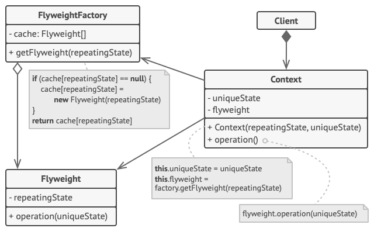

# Flyweight Pattern: Optimizing Memory Usage and Performance

The Flyweight pattern is a **structural design pattern** that reduces memory consumption and improves performance by sharing as much data as possible with similar objects. It is particularly effective when an application needs to create a **very large number of similar objects**.

> **Core insight:** Many objects in a system share identical data. Instead of storing this data in every object instance, extract it into a shared object — and pass only the unique data externally when needed.

---

## The Problem: Object Proliferation

Imagine a real-time strategy game with 10,000 soldiers on screen. Each soldier has:
- A 3D mesh (shared — all soldiers look the same)
- Texture data (shared — same skin)
- Animation states (shared — same move/attack animations)
- **Position** (unique — each soldier is in a different place)
- **Health** (unique — each soldier has individual HP)

If you store the mesh, texture, and animations in every soldier object, you're duplicating megabytes of data 10,000 times. The Flyweight pattern separates what can be shared from what must be unique.

---

## Intrinsic vs. Extrinsic State

| State Type | Definition | Storage | Example |
|---|---|---|---|
| **Intrinsic (shared)** | Data that is identical across many objects; context-independent | Inside the flyweight | Mesh, texture, sprite |
| **Extrinsic (unique)** | Data that varies per object; context-dependent | Passed by the client | Position, health, ID |

The flyweight stores only intrinsic state. Extrinsic state is passed as parameters when operations are called.

---

## Key Components



| Component | Responsibility |
|---|---|
| **Flyweight** (interface) | Declares the interface for flyweight objects; accepts extrinsic state as method parameters |
| **ConcreteFlyweight** | Implements the flyweight interface and stores intrinsic (shared) state |
| **UnsharedFlyweight** *(optional)* | Not all state can be shared; this represents non-shareable flyweight objects |
| **FlyweightFactory** | Creates and manages the pool of flyweight objects; ensures sharing and reuse |
| **Client (Context)** | Stores or computes extrinsic state; uses the factory to get flyweights |

---

## Code Example: Particle System

```typescript
// Intrinsic state — shared among particles of the same type
class ParticleType {
  constructor(
    public readonly color: string,
    public readonly sprite: string,  // imagine this is a large texture
    public readonly size: number
  ) {}

  render(x: number, y: number, velocity: number): void {
    console.log(
      `Rendering ${this.color} ${this.sprite} at (${x}, ${y}) with velocity ${velocity} — size: ${this.size}px`
    );
  }
}

// Flyweight Factory — manages the shared pool
class ParticleTypeFactory {
  private static pool: Map<string, ParticleType> = new Map();

  static getParticleType(color: string, sprite: string, size: number): ParticleType {
    const key = `${color}-${sprite}-${size}`;
    if (!this.pool.has(key)) {
      console.log(`Creating new ParticleType: ${key}`);
      this.pool.set(key, new ParticleType(color, sprite, size));
    }
    return this.pool.get(key)!;
  }

  static getPoolSize(): number { return this.pool.size; }
}

// Context — stores extrinsic state, references shared flyweight
class Particle {
  private type: ParticleType;

  constructor(
    private x: number,
    private y: number,
    private velocity: number,
    color: string,
    sprite: string,
    size: number
  ) {
    // Get shared type — not created fresh each time!
    this.type = ParticleTypeFactory.getParticleType(color, sprite, size);
  }

  render(): void {
    this.type.render(this.x, this.y, this.velocity);
  }
}

// Client — creates 10,000 particles but only 3 unique types
const particles: Particle[] = [];
for (let i = 0; i < 5000; i++) {
  particles.push(new Particle(Math.random() * 800, Math.random() * 600, Math.random() * 10, 'red', 'fire', 4));
}
for (let i = 0; i < 3000; i++) {
  particles.push(new Particle(Math.random() * 800, Math.random() * 600, Math.random() * 5, 'blue', 'ice', 6));
}
for (let i = 0; i < 2000; i++) {
  particles.push(new Particle(Math.random() * 800, Math.random() * 600, Math.random() * 8, 'green', 'acid', 3));
}

console.log(`Total particles: ${particles.length}`); // 10,000
console.log(`Unique particle types: ${ParticleTypeFactory.getPoolSize()}`); // 3 ← memory savings!
```

---

## Real-World Use Cases

| Domain | Flyweight (Shared) | Context (Unique) |
|--------|--------------------|-----------------|
| **Game development** | Character mesh, texture, animations | Position, health, direction |
| **Text rendering** | Glyph shape, font metrics | Position on screen, color |
| **Geographic maps** | Tree/building/road type | Coordinates on map |
| **String interning** | Character data | (handled by runtime automatically in Java/C#) |
| **Icon libraries** | SVG/PNG image data | Size, color tint, position |
| **Connection pools** | Database connection settings | Active query, transaction state |

---

## Memory Impact Example

| Scenario | Without Flyweight | With Flyweight |
|----------|------------------|---------------|
| 10,000 soldiers, 3MB shared data each | ~30 GB | ~3 MB (shared) + lightweight position/health data |
| 100,000 rendered glyphs, 50 unique characters | 100,000 objects with full glyph data | 50 shared glyph objects, 100,000 lightweight positions |

---

## Benefits and Trade-offs

| ✅ Benefits | ⚠️ Trade-offs |
|------------|--------------|
| Dramatically reduces RAM usage for large object collections | Increases code complexity — intrinsic/extrinsic separation requires careful design |
| Improves performance by reducing garbage collection pressure | Extrinsic state must be computed or passed on every operation |
| Enables scaling to millions of objects | Makes objects more difficult to reason about individually |
| Often transparent to client code via the factory | May not be worth it if few objects exist |

---

## When to Use It

✅ Use Flyweight when:
- The application needs to create **a very large number of similar objects** (thousands or more)
- This is causing **memory or performance problems**
- Most object state can be made **extrinsic** (passed externally)
- Objects are logically interchangeable once their extrinsic state is stripped out

❌ Avoid Flyweight when:
- The number of objects is small
- Objects don't share significant amounts of state
- The added complexity outweighs the memory savings

---

## Conclusion

The Flyweight pattern is a powerful optimization technique for memory-intensive systems. By distinguishing between what objects share (intrinsic state) and what makes each object unique (extrinsic state), you can support massive numbers of objects without proportional memory growth — enabling use cases like large-scale game worlds, text rendering engines, and real-time data visualizations that would otherwise be impossible.
