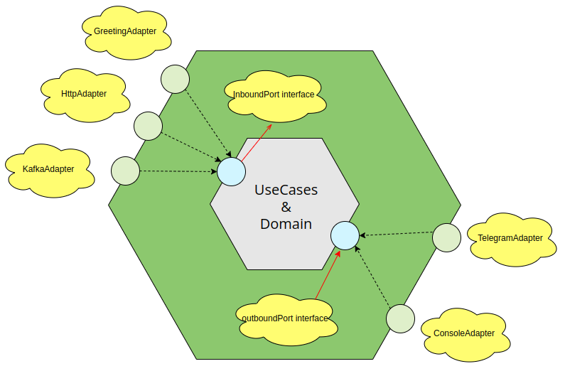

# Hexagonal Architecture with Go: Building Modular and Testable Systems

## Introduction

**Hexagonal Architecture** — also known as **Ports and Adapters** — is an architectural style created by Alistair Cockburn that aims to build scalable, clean software by isolating the core business logic from external concerns. By enforcing strict boundaries between the application's core and its infrastructure, it delivers three critical benefits:

- **Testability** — the domain logic can be tested in isolation without databases, HTTP, or message queues
- **Flexibility** — swap external systems (change your database, messaging broker, or HTTP framework) without touching business logic
- **Maintainability** — each layer has a single, well-defined responsibility

In this post, we explore how the [Hexa-Notification](https://github.com/igloar96/hexa-notification) project leverages hexagonal architecture to build a highly customizable and easy-to-extend notification system in Go.

---

## The Core Concept



The hexagon represents your **application core** — the domain and use cases. The "ports" on each face of the hexagon are interfaces that define how the core communicates with the outside world. "Adapters" implement these interfaces, translating between the core's language and external systems.

There are two kinds of ports:

| Port Type | Direction | Description |
|---|---|---|
| **Driving (Input) Port** | Outside → Core | How external actors (HTTP, CLI, Kafka) call the application |
| **Driven (Output) Port** | Core → Outside | How the application calls external systems (DB, email, Telegram) |

> The key rule: **dependencies always point inward**. The core never imports from infrastructure. Infrastructure imports from the core.

---

## Project Structure: Hexa-Notification

The Hexa-Notification project is a notification system that can receive events via HTTP or Kafka and send them to multiple destinations (Telegram, console, etc.).

### Domain Layer

The `domain` folder contains pure business entities with no framework dependencies:

```go
// domain/message.go
package domain

type Message struct {
    Title   string
    Body    string
    Channel string
}
```

This struct knows nothing about HTTP, Kafka, or Telegram. It represents a pure business concept.

---

### Use Cases Layer

The `usecases` folder implements application logic — the "what the system does." Use cases depend only on the domain and on port interfaces:

```go
// usecases/create_notification.go
package usecases

import "hexa-notification/domain"

// Output port interface — the use case defines what it NEEDS
type NotificationSender interface {
    Send(message domain.Message) error
}

// The use case: orchestrates domain + output port
type CreateNotificationUseCase struct {
    senders []NotificationSender
}

func NewCreateNotificationUseCase(senders ...NotificationSender) *CreateNotificationUseCase {
    return &CreateNotificationUseCase{senders: senders}
}

func (uc *CreateNotificationUseCase) Execute(title, body, channel string) error {
    msg := domain.Message{Title: title, Body: body, Channel: channel}
    for _, sender := range uc.senders {
        if err := sender.Send(msg); err != nil {
            return err
        }
    }
    return nil
}
```

---

### Ports and Adapters Layer

**Input Adapters (Driving)** — receive external events and call use cases:

```go
// drivers/gin_driver.go
package drivers

import (
    "net/http"
    "github.com/gin-gonic/gin"
    "hexa-notification/usecases"
)

type GinDriver struct {
    useCase *usecases.CreateNotificationUseCase
}

func (d *GinDriver) RegisterRoutes(r *gin.Engine) {
    r.POST("/notify", func(c *gin.Context) {
        var req struct {
            Title   string `json:"title"`
            Body    string `json:"body"`
            Channel string `json:"channel"`
        }
        if err := c.ShouldBindJSON(&req); err != nil {
            c.JSON(http.StatusBadRequest, gin.H{"error": err.Error()})
            return
        }
        if err := d.useCase.Execute(req.Title, req.Body, req.Channel); err != nil {
            c.JSON(http.StatusInternalServerError, gin.H{"error": err.Error()})
            return
        }
        c.JSON(http.StatusOK, gin.H{"status": "sent"})
    })
}
```

**Output Adapters (Driven)** — implement output port interfaces to talk to external systems:

```go
// driven/telegram_adapter.go
package driven

import (
    "fmt"
    "hexa-notification/domain"
)

type TelegramNotificationAdapter struct {
    botToken string
    chatID   string
}

// Implements usecases.NotificationSender
func (a *TelegramNotificationAdapter) Send(msg domain.Message) error {
    fmt.Printf("[Telegram] Sending to chat %s: %s - %s\n", a.chatID, msg.Title, msg.Body)
    // Real implementation would call the Telegram Bot API here
    return nil
}
```

---

## Dependency Flow

```
HTTP Request
    ↓
GinDriver (Input Adapter)
    ↓
CreateNotificationUseCase (Application Core)
    ↓
NotificationSender interface (Output Port)
    ↓
TelegramAdapter / ConsoleAdapter (Output Adapters)
    ↓
Telegram API / Console
```

Notice: the **use case never imports** from `drivers` or `driven`. The dependency flow is always inward.

---

## Why This Matters for Testing

Because the use case depends only on the `NotificationSender` interface, you can test it with a mock:

```go
func TestCreateNotificationUseCase(t *testing.T) {
    // Mock sender — no real HTTP/Telegram needed
    mock := &MockSender{}
    uc := usecases.NewCreateNotificationUseCase(mock)

    err := uc.Execute("Alert", "Server is down", "ops")

    assert.NoError(t, err)
    assert.Equal(t, 1, mock.CallCount)
}
```

You can run the entire test suite without any external services.

---

## Benefits in Practice

| Benefit | How Hexagonal Architecture Delivers It |
|---------|---------------------------------------|
| **Fast unit tests** | Domain and use cases are pure Go — no mocks for HTTP/DB needed |
| **Easy to swap infrastructure** | Change from Gin to Echo? Only update the input adapter |
| **Multiple delivery mechanisms** | Add Kafka driver without touching business logic |
| **Clear ownership** | Domain team owns core; platform team owns adapters |

---

## Further Reading

1. [Alistair Cockburn — Hexagonal Architecture (original article)](https://alistair.cockburn.us/hexagonal-architecture/)
2. [Papers We Love — Three Principles and an Implementation Example (YouTube)](https://www.youtube.com/watch?v=th4AgBcrEHA)
3. [Building Evolutionary Architectures — O'Reilly](https://www.oreilly.com/library/view/building-evolutionary-architectures/9781491986356/)

---

> If you found this post helpful, consider giving the [Hexa-Notification project a star ⭐ on GitHub](https://github.com/igloar96/hexa-notification). Contributions and feedback are always welcome!
