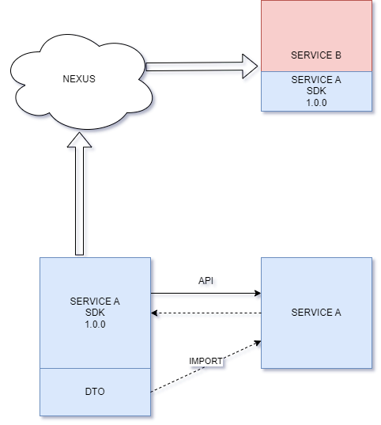
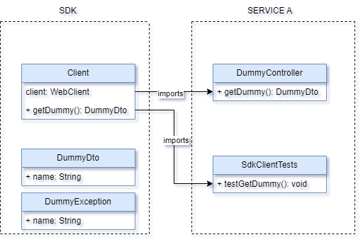

# Managing Microservices with SDKs


## Introduction

The rise of microservices architecture has transformed the way we build and deploy applications. While this approach offers scalability and flexibility, it also introduces a significant challenge: **how do multiple teams communicate reliably with each other's services?**

Without a clear contract enforcement mechanism, teams constantly step on each other's toes — breaking integrations, causing bugs in production, and spending hours debugging issues that could have been caught at compile time.

---

## The Challenge: Inter-Team API Communication

### Problem 1: Outdated OpenAPI Documentation

API documentation is a snapshot in time. As services evolve, documentation quickly becomes stale. Developers waste time debugging incorrect endpoints, mismatched request formats, and undocumented error codes.

**The result:** Frustration, lost productivity, and production incidents caused by incorrect API assumptions.

### Problem 2: Inconsistent Data Transfer Objects (DTOs)

When a developer modifies a DTO field — renames a property, changes a type, adds a required field — other teams' services that depend on that DTO silently break. Without a shared, versioned contract, these mismatches are discovered at runtime, often in production.

**The result:** Unexpected errors, downtime, and the need for urgent rollbacks.

---

## The Solution: SDKs as Living Contracts

Instead of relying on documentation and hope, we can use a **Software Development Kit (SDK)** that encapsulates the API contract and ships it as a versioned dependency.

The SDK becomes the **single source of truth** for how to communicate with a service. When the service evolves, the SDK is updated and released as a new version — consumers can adopt it at their own pace, with full visibility into what changed.

### Proposal Architecture



The SDK contains three key components:

| Component | Purpose |
|---|---|
| **DTOs** | Shared data models that both producer and consumer agree on |
| **Clients** | Pre-built, type-safe HTTP clients that handle the API calls |
| **Exceptions** | Typed exceptions that map API error codes to meaningful domain errors |

---

## Implementation: Spring Boot WebFlux SDK

The SDK is built using **Spring Boot's WebFlux** library, providing reactive, non-blocking HTTP clients out of the box.

### Class Diagram



### Example SDK Structure

```
sdk/
├── src/main/java/com/example/sdk/
│   ├── dto/
│   │   ├── UserDTO.java
│   │   ├── OrderDTO.java
│   │   └── CreateOrderRequest.java
│   ├── client/
│   │   ├── OrderServiceClient.java
│   │   └── UserServiceClient.java
│   └── exception/
│       ├── ServiceUnavailableException.java
│       └── ResourceNotFoundException.java
└── pom.xml
```

### Example: SDK Client

```java
@Component
public class OrderServiceClient {

    private final WebClient webClient;

    public OrderServiceClient(WebClient.Builder builder,
                              @Value("${services.order.url}") String baseUrl) {
        this.webClient = builder.baseUrl(baseUrl).build();
    }

    public Mono<OrderDTO> getOrder(String orderId) {
        return webClient.get()
                .uri("/orders/{id}", orderId)
                .retrieve()
                .onStatus(status -> status.is4xxClientError(), this::handleClientError)
                .bodyToMono(OrderDTO.class);
    }

    public Mono<OrderDTO> createOrder(CreateOrderRequest request) {
        return webClient.post()
                .uri("/orders")
                .bodyValue(request)
                .retrieve()
                .bodyToMono(OrderDTO.class);
    }

    private Mono<? extends Throwable> handleClientError(ClientResponse response) {
        return response.bodyToMono(String.class)
                .map(body -> new ResourceNotFoundException("Order not found: " + body));
    }
}
```

---

## Dependency Scope Strategy

The SDK is published as a Maven/Gradle dependency. The key decision: use **provided** scope.

```xml
<dependency>
    <groupId>com.example</groupId>
    <artifactId>order-service-sdk</artifactId>
    <version>1.2.0</version>
    <scope>provided</scope>
</dependency>
```

**Why `provided` scope?** This ensures:
1. The SDK is available for both consuming services and the service owner (for integration testing)
2. The service owner is accountable for keeping the SDK up to date
3. Integration tests can use the actual clients from the SDK, catching contract issues before they reach production

---

## The Shared DTO Debate

> **Should DTOs live in the SDK or in a separate shared library?**

We recommend keeping them **inside the SDK**. Here's why:

| Approach | Pros | Cons |
|---|---|---|
| **DTOs in SDK** | Single package, accountability on service owner, enables integration tests via clients | Service owner must keep SDK updated |
| **Separate DTO library** | DTOs can be shared without importing clients | Splits responsibility, harder to maintain consistency |

By bundling DTOs with the client, the team that owns the service is directly responsible for delivering accurate, up-to-date interfaces. This accountability is key to keeping contracts fresh.

---

## Benefits of the SDK Approach

| Benefit | Description |
|---|---|
| **Compile-time safety** | Breaking changes are caught immediately when consuming teams update the SDK |
| **Self-documenting** | The SDK itself is the most up-to-date documentation of the API |
| **Reduced integration bugs** | No manual HTTP calls, no JSON parsing — the SDK handles it all |
| **Easier onboarding** | New developers import the SDK and get IntelliSense/autocompletion immediately |
| **Versioned contracts** | Semantic versioning communicates breaking vs. non-breaking changes clearly |

---

## Conclusion

Managing microservices in a multi-team environment requires deliberate effort to keep API contracts consistent and trustworthy. SDKs transform a documentation problem into a dependency problem — one that compilers and build systems can catch automatically.

By shipping an SDK alongside each service, teams shift from reactive debugging ("why is this field missing?") to proactive development ("the SDK updated to v2.0.0 — what changed?").

[🔗 View the proof-of-concept on GitHub](https://github.com/bylidev/sdk-poc)

> 🚀 Embrace the power of SDKs to bridge the gap between teams and unlock the full potential of your microservices ecosystem!
