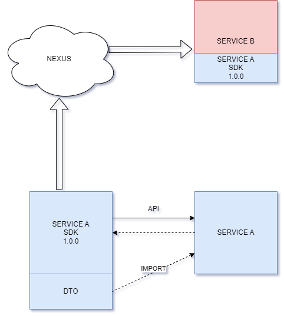
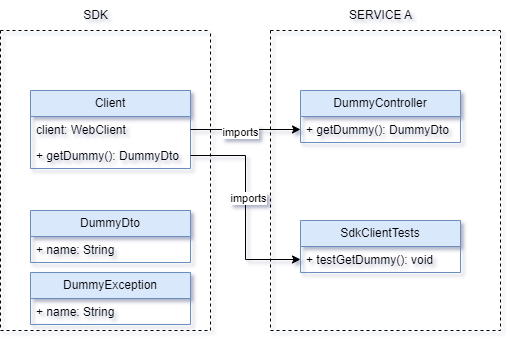

# Managing Microservices: Navigating Team Conflicts and API Delegation


## Introduction

The rise of microservices architecture has transformed the way we build and deploy applications. While this approach offers scalability and flexibility, it also brings challenges, especially when multiple teams are involved in developing and maintaining these services. One common issue that arises is the potential for conflicts between teams when communicating with each other's APIs.

## The Challenge: Communication Between Microservices

### Outdated OpenAPI Documentation

One of the main issues teams face is outdated OpenAPI documentation. When services evolve, the documentation can quickly become obsolete, leading to misunderstandings and errors. Developers may waste time trying to figure out the correct endpoints, request/response formats, and error codes, causing delays and frustration.

### Inconsistent Data Transfer Objects (DTOs)

Another challenge is maintaining consistency across Data Transfer Objects (DTOs). If a developer makes changes to an attribute in a DTO without notifying other teams, it can break the functionality of dependent services. This lack of communication can lead to unexpected errors and downtime, affecting the overall reliability of the system.

## Bridging the Gap with SDKs

To mitigate these challenges, one solution is to use Software Development Kits (SDKs) to abstract the complexity of interacting with microservices. By encapsulating the API calls and handling data transformations within the SDK, teams can ensure consistency and reduce the risk of conflicts.

### Proposal: SDK Solution



We propose creating an SDK that includes DTOs, clients, and exceptions using Spring Boot's WebFlux library. By embedding the DTOs within the SDK, developers are encouraged to use the standardized data models across services, ensuring consistency.

#### Key Features of the SDK:

- **DTOs**: Contains all Data Transfer Objects shared across services.

- **Clients**: Encapsulates API calls using WebFlux, providing a simplified interface for service interaction.

- **Exceptions**: Handles custom exceptions to manage errors effectively.

#### Shared DTO Library Debate

While it could be debated to have a shared DTO library between the SDK and the service, we decided to keep it within the SDK. This way, the SDK can be imported in a "provided" scope, allowing not only the use of DTOs but also enabling the service owner to perform integration tests using the clients located in the SDK. This approach ensures that the developer responsible for the SDK delivers an up-to-date package, promoting accountability and consistency across services.



### Benefits of Using SDKs

- **Consistency**: SDKs provide a standardized way to interact with microservices, ensuring that all teams use the same interfaces and data models.

- **Reduced Complexity**: By abstracting the underlying API calls, SDKs simplify the integration process and make it easier for developers to consume services.

- **Improved Communication**: SDKs can serve as a central point of communication between teams, documenting best practices and ensuring everyone is on the same page.

## Conclusion

Managing microservices in a multi-team environment presents unique challenges that require careful planning and coordination. By addressing issues like outdated documentation and inconsistent DTOs proactively, teams can streamline communication and improve collaboration. Adopting SDKs, especially one tailored to the needs of the organization, can further enhance consistency and simplify integration, making it easier to navigate the complexities of microservices architecture.


[view poc project on github](https://github.com/bylidev/sdk-poc)

🚀 Embrace the power of SDKs to bridge the gap between teams and unlock the full potential of your microservices ecosystem!
```
