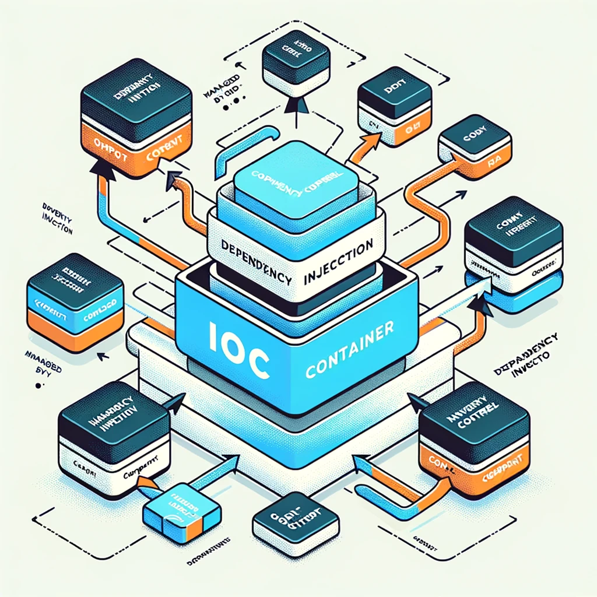

# Compiled IoC for Java with Dagger



Most Java developers are familiar with Spring Boot's dependency injection — a powerful but runtime-based IoC framework that uses reflection under the hood. **Dagger** takes a fundamentally different approach: it resolves and generates all dependency injection code **at compile time**, giving you the same ergonomics with dramatically better performance characteristics.

---

## What is Inversion of Control (IoC)?

**Inversion of Control** is a design principle where the control of object creation and dependency wiring is delegated from the application code to a framework or container.

| Approach | Who creates objects? | How are dependencies wired? |
|----------|---------------------|---------------------------|
| **Without IoC** | Your code (`new MyService()`) | Manually, in your code |
| **With Runtime IoC** (Spring) | Framework at startup | Via reflection, at runtime |
| **With Compiled IoC** (Dagger) | Framework at compile time | Via generated code, zero reflection |

**Without IoC** — you manage everything manually:
```java
// You create and wire everything yourself
Repository repo = new RepositoryImpl();
Client client = new ClientImpl();
DummyUseCase useCase = new DummyUseCase(client, repo);
```

**With IoC** — the container handles creation and wiring:
```java
// You declare what you need; the container provides it
@Inject
DummyUseCase useCase; // container creates and injects this
```

---

## Why Dagger? Advantages Over Runtime IoC

| Feature | Spring Boot (Runtime) | Dagger (Compiled) |
|---------|----------------------|-------------------|
| **Dependency resolution** | Runtime, via reflection | Compile time, via code generation |
| **Startup performance** | Slower (reflection overhead) | Faster (pre-generated code) |
| **Runtime errors** | Wiring errors crash at startup | Wiring errors are **compile errors** |
| **Memory footprint** | Higher (reflection metadata) | Lower (generated code only) |
| **IDE support** | Good | Excellent (generated code is navigable) |
| **Type safety** | Good | Excellent (errors at compile time) |

> 💡 Dagger is particularly valuable in **Android development** and **Java services** where startup time and memory efficiency are critical.

---

## Installation

Add the Dagger dependency to your `pom.xml`:

```xml
<!-- Runtime dependency -->
<dependency>
    <groupId>com.google.dagger</groupId>
    <artifactId>dagger</artifactId>
    <version>${dagger.version}</version>
    <scope>compile</scope>
</dependency>
```

Configure the annotation processor to generate the DI code at compile time:

```xml
<build>
    <plugins>
        <plugin>
            <groupId>org.apache.maven.plugins</groupId>
            <artifactId>maven-compiler-plugin</artifactId>
            <version>3.8.1</version>
            <configuration>
                <source>${maven.compiler.source}</source>
                <target>${maven.compiler.target}</target>
                <annotationProcessorPaths combine.children="append">
                    <path>
                        <groupId>com.google.dagger</groupId>
                        <artifactId>dagger-compiler</artifactId>
                        <version>${dagger.version}</version>
                    </path>
                </annotationProcessorPaths>
            </configuration>
        </plugin>
    </plugins>
</build>
```

---

## Usage

### Step 1: Define a Module

A `@Module` class declares how to create your dependencies — the recipes Dagger uses to build your object graph:

```java
@Module
public class DaggerModule {

    @Provides
    @Singleton
    Client provideClient() {
        return new ClientImpl();
    }

    @Provides
    Repository provideRepository() {
        return new RepositoryImpl();
    }

    @Provides
    DummyUseCase provideDummyUseCase(Client client, Repository repository) {
        // Dagger automatically resolves and passes client and repository
        return new DummyUseCase(client, repository);
    }
}
```

### Step 2: Define a Component

A `@Component` is the entry point to the dependency graph — equivalent to the Spring Application Context:

```java
@Component(modules = DaggerModule.class)
public interface DaggerComponent {
    DummyUseCase getDummyUseCase();
}
```

### Step 3: Use the Generated Component

After compilation, Dagger generates a `DaggerDaggerComponent` class:

```java
public class Main {
    public static void main(String[] args) {
        // Dagger generates this class at compile time
        DaggerComponent component = DaggerDaggerComponent.builder()
                .daggerModule(new DaggerModule())
                .build();

        DummyUseCase useCase = component.getDummyUseCase();
        useCase.execute();
    }
}
```

---

## Testing and Verifying Code Generation

### 1. Compile and build the project

```bash
mvn clean install
```

This triggers the Dagger annotation processor which generates the DI glue code.

### 2. Inspect the generated code

After a successful build, navigate to:

```
target/generated-sources/annotations/
```

You'll find files like `DaggerDaggerComponent.java` — fully readable, debuggable, and navigable Java code. This transparency is one of Dagger's biggest advantages: **the generated code has no magic**.

### 3. Verify with a test

```java
@Test
public void testDaggerWiring() {
    DaggerComponent component = DaggerDaggerComponent.create();
    DummyUseCase useCase = component.getDummyUseCase();
    
    assertNotNull(useCase); // Dagger wired it correctly
}
```

---

## Dagger vs. Spring: When to Choose Which?

| Use Case | Recommended |
|---|---|
| Android application | **Dagger / Hilt** |
| Java microservice with fast startup requirements | **Dagger** |
| Full-stack Spring web application | **Spring Boot** |
| Rapid prototyping | **Spring Boot** |
| Embedded or resource-constrained Java | **Dagger** |

---

## Conclusion

Dagger brings the ergonomics of dependency injection to Java without the runtime cost of reflection. By resolving dependencies at compile time, it catches wiring errors early, reduces startup latency, and produces transparent, readable generated code. For performance-sensitive Java applications — especially on Android or in cloud environments where cold start time matters — Dagger is a compelling alternative to runtime IoC frameworks.

[🔗 View on GitHub](https://github.com/bylidev/byli-lab/releases/tag/DAGGER)
