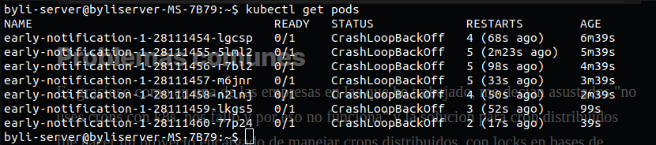

# Resilient CronJob-based Webhook in Kubernetes for Distributed Services

Running scheduled tasks in a containerized, multi-replica environment introduces a non-trivial problem: how do you ensure a job runs **exactly once** across all replicas, with automatic retries on failure — without building your own scheduler?

This post covers a production-tested pattern using Kubernetes CronJobs and a curl-based webhook approach.

---

## The Requirement

The scenario: a service `X` running with **10 replicas** needs a scheduled task that:

1. Executes **only once** — not on every replica
2. Has **automatic retry** logic on failure
3. Can be **monitored** through Kubernetes-native tooling
4. Requires **no application code changes** to implement

---

## Why Not Use Application-Level Scheduling?

The naive approach — using `@Scheduled` in Spring Boot, cron expressions in a process, or a scheduling library — fails in this scenario because:

- Every replica runs its own scheduler
- With 10 replicas, a scheduled task runs **10 times** instead of once
- Workarounds (database locks, leader election) add complexity and become custom-built infrastructure

> ⚠️ A common anti-pattern seen in the wild: teams build entire internal projects to manage distributed cron jobs, complete with database lock tables and tightly coupled `@Schedule` annotations — reinventing what Kubernetes already provides natively.

---

## The Solution: Kubernetes CronJob + curl Webhook

The key insight: instead of scheduling logic inside the application, use a **Kubernetes CronJob** that fires an HTTP request to the service's webhook endpoint. Kubernetes load-balances the request to a single replica. Failure handling comes for free via `restartPolicy`.

```yaml
apiVersion: batch/v1
kind: CronJob
metadata:
  name: service-x-monthly-job
spec:
  schedule: "00 00 1 * *"   # First of every month at midnight
  jobTemplate:
    spec:
      template:
        spec:
          containers:
            - name: webhook-caller
              image: curlimages/curl
              resources:
                limits:
                  cpu: "100m"
                  memory: "64Mi"
                requests:
                  cpu: "50m"
                  memory: "32Mi"
              args:
                - /bin/sh
                - -c
                - |
                  echo "$(date) — Starting scheduled webhook call"
                  HTTP_STATUS=$(curl \
                    -X POST \
                    -s \
                    -o /dev/null \
                    -w "%{http_code}" \
                    --http2 \
                    http://service-x:80/webhook)

                  echo "Response status: $HTTP_STATUS"

                  if [ "$HTTP_STATUS" -ne 200 ]; then
                    echo "ERROR: Webhook failed with HTTP $HTTP_STATUS" && exit 1
                  else
                    echo "SUCCESS: Webhook completed" && exit 0
                  fi
          restartPolicy: OnFailure
  successfulJobsHistoryLimit: 12
  failedJobsHistoryLimit: 12
```

---

## How This Works

| Concern | Solution |
|---------|---------|
| **Single execution** | The CronJob creates one Pod; Kubernetes load-balances the HTTP request to one replica of `service-x` |
| **Retry on failure** | `restartPolicy: OnFailure` — Kubernetes automatically retries the Pod if it exits with a non-zero code |
| **Failure detection** | The script checks the HTTP status code; any non-200 response causes `exit 1`, triggering a retry |
| **History retention** | `successfulJobsHistoryLimit: 12` — last 12 successful jobs are retained for auditing |
| **Monitoring** | Jobs are visible in `kubectl get jobs` and `kubectl describe job <name>` |

---

## Retry Behavior in Action



When the webhook returns a non-200 status, the Pod exits with code 1. With `restartPolicy: OnFailure`, Kubernetes:

1. Marks the Pod as failed
2. Creates a new Pod (with exponential backoff)
3. Retries until it succeeds or hits `backoffLimit` (default: 6)

You can observe retries with:

```bash
kubectl get pods --selector=job-name=service-x-monthly-job
kubectl logs <pod-name>
```

---

## The Anti-Pattern: Getting It Wrong

Here's what **not** to do — a real pattern seen in production that silently swallows failures:

```yaml
args:
  - /bin/sh
  - -c
  - |
    echo "Starting job"
    curl -X POST --http2 http://service-x:80/webhook
    exit 0   # ← WRONG: always exits successfully, even on HTTP 500 or network failure
```

**Problems with this approach:**
- `curl` exits with 0 on HTTP errors (e.g., 500, 404) — the job always appears successful
- No retry is triggered because exit code is always 0
- Failures are completely invisible until business impact is noticed
- The CronJob history shows 100% success — a false sense of reliability

The result: teams discover months later that their scheduled tasks have been silently failing, and they've been looking at green job history the whole time.

---

## Schedule Reference

Use [crontab.guru](https://crontab.guru/) to build and validate your cron expressions:

| Schedule | Expression |
|----------|-----------|
| Every day at midnight | `0 0 * * *` |
| Every Monday at 9am | `0 9 * * 1` |
| First of every month | `0 0 1 * *` |
| Every 15 minutes | `*/15 * * * *` |

---

## Conclusion

Kubernetes CronJobs combined with a webhook pattern provide a **robust, observable, and zero-code scheduling solution** for distributed services. The approach leverages native Kubernetes primitives — scheduling, restart policies, job history — to handle concerns that teams often try to solve by building their own infrastructure.

> Never underestimate the tried-and-true tools that have been battle-tested by the community. Before building a custom distributed scheduler, evaluate what Kubernetes already provides out of the box.
