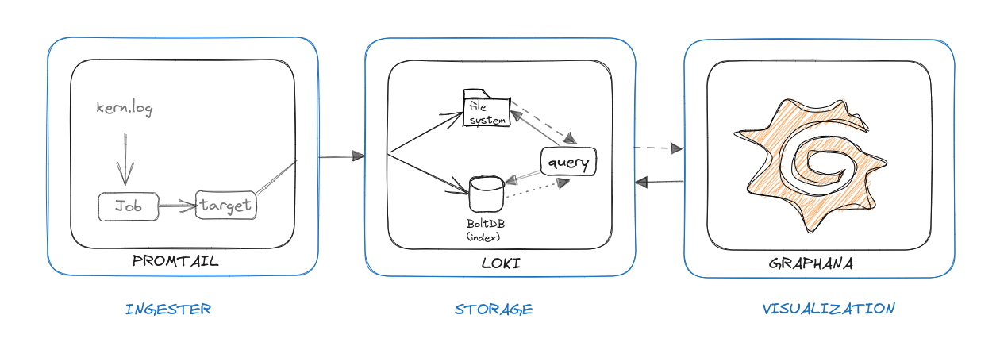
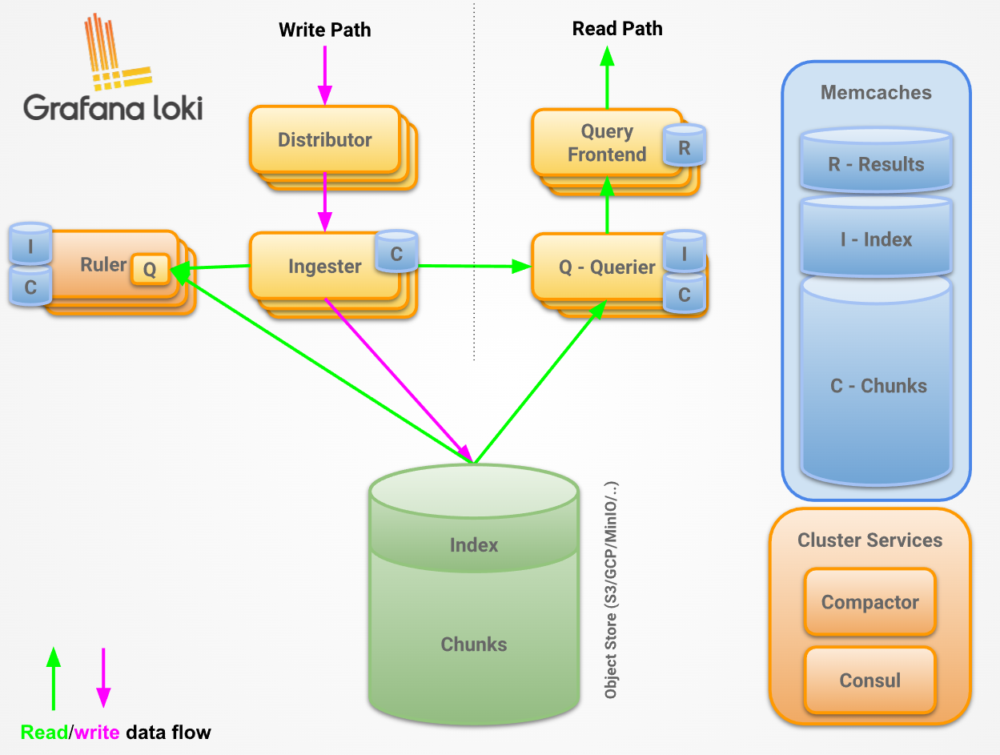

# A Guide to Log Management with Promtail, Loki, and Grafana



Effective log management is a cornerstone of production system observability. Without it, debugging incidents becomes a frustrating exercise of SSH-ing into servers and grepping through files. This guide walks through building a centralized log pipeline using three powerful open-source tools from the Grafana ecosystem.

---

## The Three Pillars of Log Management

| Component | Role | Analogy |
|---|---|---|
| **Promtail** | Log collector / shipper | The postal carrier — picks up logs and delivers them |
| **Loki** | Log storage and indexing | The post office — stores and organizes the mail |
| **Grafana** | Visualization and querying | The dashboard — lets you read and analyze everything |

### 1. Data Ingestion — Promtail

Promtail is a log scraping agent that **tails log files** and ships them to Loki. It's lightweight, configurable, and runs alongside your applications (as a sidecar, DaemonSet, or standalone process).

Key capabilities:
- Discovers log files via file glob patterns
- Attaches labels (host, job, service) for efficient querying
- Supports pipeline stages for parsing, filtering, and transforming log lines
- Handles log rotation automatically

### 2. Log Storage — Loki

Loki is a **horizontally scalable, highly available log aggregation system** inspired by Prometheus. Unlike Elasticsearch, it indexes only metadata (labels), not the full log content — making it dramatically more cost-efficient for large log volumes.

Key capabilities:
- Label-based log organization (same model as Prometheus metrics)
- Efficient storage using chunk compression
- Native integration with Grafana
- Supports LogQL — a powerful query language for log data

### 3. Visualization — Grafana

Grafana provides a **unified observability dashboard** that integrates seamlessly with Loki. You can build dashboards, write LogQL queries, set up alerts, and correlate logs with metrics from Prometheus — all in one place.

---

## Architecture Overview



```
Applications / Servers
        ↓
    Promtail (agent)
        ↓
    Loki (storage)
        ↓
    Grafana (visualization)
```

---

## Setup with Docker Compose

### Create the `docker-compose.yml`

```yaml
version: "3.8"

services:
  grafana:
    image: grafana/grafana:latest
    hostname: grafana
    volumes:
      - /home/byli-server/nfs/volumes/grafana:/var/lib/grafana
    ports:
      - "3003:3000"
    networks:
      - logs

  promtail:
    image: grafana/promtail:latest
    command:
      - '-config.file=/etc/promtail/promtail-config.yaml'
    volumes:
      - /home/byli-server/nfs/volumes/promtail/config/promtail.yaml:/etc/promtail/promtail-config.yaml
      - /var/log/kern.log:/var/log/kern.log:ro
    restart: always
    networks:
      - logs

  loki:
    image: grafana/loki:latest
    volumes:
      - /home/byli-server/nfs/volumes/loki/config/loki.yaml:/data
    command: -config.file=/etc/loki/local-config.yaml
    restart: always
    networks:
      - logs

networks:
  logs:
```

---

### Configure Promtail

Create `/home/byli-server/nfs/volumes/promtail/config/promtail.yaml`:

```yaml
server:
  http_listen_port: 9080
  grpc_listen_port: 0

positions:
  filename: /tmp/positions.yaml

clients:
  - url: http://loki:3100/loki/api/v1/push

pipeline_stages:
  - match:
      selector: '{job="kernel-errors"}'
      stages:
        - regex:
            expression: "error|fail|panic"

scrape_configs:
  - job_name: kernel-errors
    static_configs:
      - targets:
          - localhost
        labels:
          job: kernlog
          host: byli-server
          __path__: /var/log/kern.log
```

**Key configuration fields:**

| Field | Purpose |
|---|---|
| `clients.url` | Loki's push endpoint |
| `pipeline_stages` | Transforms and filters applied to log lines before shipping |
| `scrape_configs` | Defines which files to tail and what labels to attach |
| `labels` | Metadata attached to every log line — used for filtering in Grafana |

---

### Configure Loki

Create `/home/byli-server/nfs/volumes/loki/config/loki.yaml`:

```yaml
auth_enabled: false

server:
  http_listen_port: 3100
  grpc_listen_port: 9095

ingester:
  lifecycler:
    address: 127.0.0.1
    ring:
      kvstore:
        store: inmemory
      replication_factor: 1
  chunk_idle_period: 5m
  chunk_retain_period: 30s

schema_config:
  configs:
    - from: 2023-01-01
      store: boltdb
      object_store: filesystem
      schema: v11
      index:
        prefix: index_
        period: 24h

storage_config:
  boltdb:
    directory: /data/loki/index
  filesystem:
    directory: /data/loki/chunks

limits_config:
  enforce_metric_name: false
  reject_old_samples: true
  reject_old_samples_max_age: 168h

chunk_store_config:
  max_look_back_period: 0s

table_manager:
  retention_deletes_enabled: true
  retention_period: 720h
```

**Key configuration options:**

| Setting | Value | Purpose |
|---|---|---|
| `chunk_idle_period` | 5m | How long to wait before flushing an idle chunk to storage |
| `chunk_retain_period` | 30s | Minimum time to keep a chunk in memory after flushing |
| `retention_period` | 720h (30 days) | How long to retain log data before deletion |
| `reject_old_samples_max_age` | 168h (7 days) | Reject log lines older than this threshold |

---

## Starting the Stack

```bash
docker-compose up -d
```

Access Grafana at `http://localhost:3003`

**Add Loki as a data source:**
1. Go to Configuration → Data Sources → Add data source
2. Select **Loki**
3. Set URL to `http://loki:3100`
4. Click **Save & Test**

---

## Querying Logs with LogQL

Once connected, you can query logs in Grafana's Explore view:

```logql
# All kernel errors from the byli-server host
{host="byli-server", job="kernlog"} |= "error"

# Filter by multiple labels + pattern
{host="byli-server"} |~ "error|fail|panic"

# Count errors per minute
count_over_time({host="byli-server"} |= "error" [1m])
```

---

## Alternative Tools

This stack (Promtail + Loki + Grafana) is just one approach. The same architecture applies regardless of your specific tooling choices:

| Layer | Alternatives |
|---|---|
| **Collection** | Fluentd, Fluent Bit, Logstash, Vector |
| **Storage** | Elasticsearch, ClickHouse, OpenSearch |
| **Visualization** | Kibana, Datadog, Splunk, OpenTelemetry |

The key principle — **ingest, store, visualize** — remains constant.

---

## Conclusion

A centralized log management pipeline transforms debugging from a frustrating manual process into a structured, searchable, and alertable system. The Promtail + Loki + Grafana stack is lightweight, cost-efficient, and deeply integrated — making it an excellent choice for homelabs, Kubernetes clusters, and production microservices environments alike.
