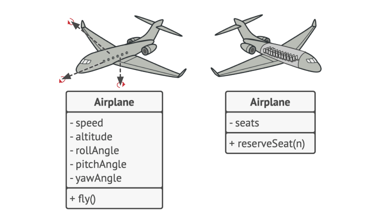
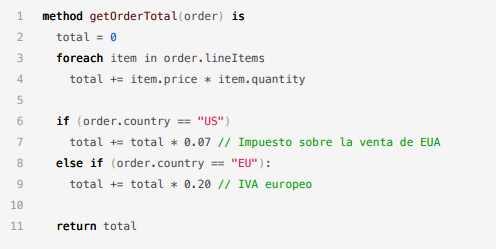
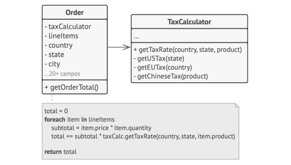
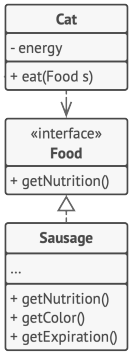

# The Four Pillars of Object-Oriented Programming

Object-Oriented Programming (OOP) is built on four foundational principles — commonly referred to as **"the four pillars."** Understanding these pillars is essential before diving into design patterns, as virtually every pattern is an application of one or more of these principles.

> These aren't just academic concepts — they are practical tools that directly influence how maintainable, flexible, and robust your code is in production.

---

## 1. Abstraction

**Abstraction** means representing real-world entities in code by exposing only the relevant attributes and behaviors — hiding the irrelevant details.

> You don't need to model 100% of an object's complexity. Model only what your system actually uses.

### Example: Modeling an Airplane

When building a flight booking system, you don't care about the airplane's metallurgical composition or engine thermodynamics. You care about:
- Seat capacity
- Route
- Flight number
- Departure and arrival times



By abstracting away irrelevant details, you keep your model focused, your code simpler, and your system easier to reason about.

**Key benefit:** Reduces cognitive load — developers work with a simplified model rather than the full complexity of the real world.

---

## 2. Encapsulation

**Encapsulation** is the practice of bundling related data and behavior into a single unit (a class) and **controlling access** to the internal state through well-defined interfaces.

> Hide internal implementation details. Expose only what external code needs to interact with.

### Example: E-Commerce Order System

A common mistake is calculating order totals and taxes in a single, sprawling method:

```java
// ❌ Poor encapsulation — everything mixed together
public double calculateTotal(Order order) {
    double subtotal = 0;
    for (Item item : order.getItems()) {
        subtotal += item.getPrice() * item.getQuantity();
    }
    double tax = subtotal * 0.21;  // Tax logic buried inside Order
    return subtotal + tax;
}
```



With proper encapsulation, tax calculation is isolated in its own class:

```java
// ✅ Proper encapsulation
public class TaxCalculator {
    private static final double TAX_RATE = 0.21;

    public double calculate(double subtotal) {
        return subtotal * TAX_RATE;
    }
}

public class Order {
    private final TaxCalculator taxCalculator = new TaxCalculator();

    public double getTotal() {
        double subtotal = calculateSubtotal();
        return subtotal + taxCalculator.calculate(subtotal);
    }

    private double calculateSubtotal() { /* ... */ }
}
```



**Key benefit:** Changing tax rules only requires modifying `TaxCalculator` — not every method that computes totals. This is the Single Responsibility Principle in action.

---

## 3. Polymorphism

**Polymorphism** allows objects of different classes to be treated as objects of a common superclass or interface. It enables **programming to an interface rather than an implementation**.

> Write code that works with the abstraction — not the concrete type. Then swap implementations without touching the calling code.

### Example: A Cat's Diet

A `Cat` depends on `Food` to generate energy. Without polymorphism, the Cat would need to know exactly what type of food it's eating:

```java
// ❌ Coupled to concrete food type
class Cat {
    public void eat(Fish fish) { this.energy += fish.calories(); }
    // Need to add a new method for every food type!
}
```

With polymorphism:

```java
// ✅ Programmed to the interface
interface Food {
    int getCalories();
}

class Fish implements Food { public int getCalories() { return 200; } }
class Chicken implements Food { public int getCalories() { return 300; } }
class VeganFood implements Food { public int getCalories() { return 150; } }

class Cat {
    private int energy = 0;

    public void eat(Food food) {
        this.energy += food.getCalories(); // Works with ANY food
    }
}
```



**Key benefit:** You can introduce new `Food` implementations without modifying `Cat`. This is the Open/Closed Principle in action.

---

## 4. Inheritance

**Inheritance** enables the creation of new classes based on existing ones, promoting **code reuse**. A subclass inherits the attributes and methods of its parent class and can extend or override them.

### Example: Vehicle Hierarchy

```java
// Base class
public abstract class Vehicle {
    protected int speed;
    protected String brand;

    public void accelerate(int amount) { this.speed += amount; }
    public abstract String getFuelType(); // Must be implemented by subclasses
}

// Subclasses inherit and extend
public class ElectricCar extends Vehicle {
    private int batteryLevel;

    @Override
    public String getFuelType() { return "Electric"; }

    public void charge() { this.batteryLevel = 100; }
}

public class GasolineCar extends Vehicle {
    @Override
    public String getFuelType() { return "Gasoline"; }
}
```


**Key benefit:** Shared behavior (like `accelerate`) is defined once in the parent class and reused across all subclasses — no duplication.

> ⚠️ **Inheritance caveat:** Overuse of inheritance creates fragile class hierarchies. Subclasses must implement all abstract methods from the parent class. When you need flexibility over multiple dimensions, prefer composition — which is the cornerstone of many design patterns.

---

## Summary

| Pillar | Core Question | Key Benefit |
|--------|-------------|-------------|
| **Abstraction** | What does the client need to see? | Reduces complexity by hiding irrelevant details |
| **Encapsulation** | How do we protect internal state? | Prevents unintended side effects; makes code easier to change |
| **Polymorphism** | Can this work with different types? | Enables flexible, interchangeable implementations |
| **Inheritance** | What can be reused from the parent? | Reduces duplication through code reuse |

---

## Why These Matter for Design Patterns

Every design pattern is built on these pillars:

- **Factory Method** → Polymorphism (clients work with abstract product types)
- **Decorator** → Composition over Inheritance
- **Strategy** → Polymorphism (interchangeable algorithms)
- **Template Method** → Inheritance (define skeleton, defer steps to subclasses)
- **Adapter** → Abstraction + Polymorphism

Mastering the four pillars gives you the foundation to understand not just *how* each pattern works, but *why* it exists.
