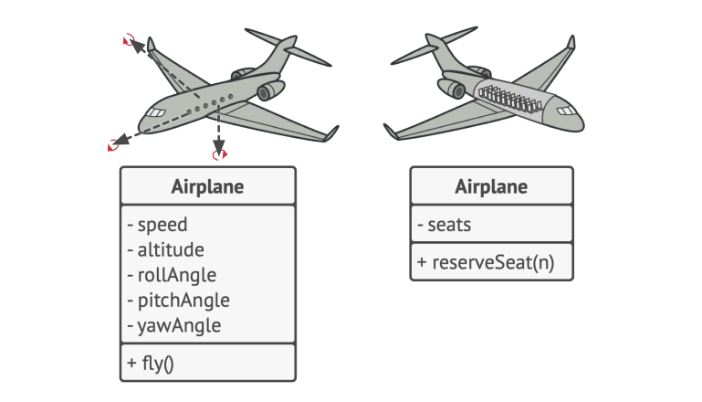
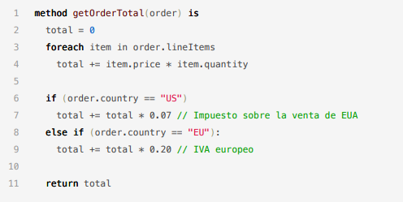
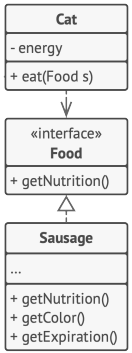

# OOP Pillars

The object-oriented programming paradigm has four basic principles known as "**the four pillars of OOP**" that we must adhere to:

1.  **Abstraction**: It involves representing real-world objects in classes by including only the relevant attributes and methods. We don't need to represent 100% of the object's attributes and actions unless we use them.
    
    Example: Representation of an airplane.
    
    
    
2.  **Encapsulation**: It helps minimize the impact of code changes by grouping related data and behavior into a single unit, known as a class. It involves hiding internal implementation details and providing controlled access through methods.
    
    Example: Avoiding a common mistake in an e-commerce system where order calculation and tax calculation are performed together in the same method.
    
    
    
    Encapsulation can be achieved by encapsulating tax calculation in a private method and separating it into a new class, thereby improving code organization.
    
    
    
3.  **Polymorphism**: It allows objects of different classes to be treated as objects of a common superclass. Polymorphism enables programming to an interface rather than an implementation. It promotes code flexibility and reusability.
    
    Example: Demonstrating the concept of polymorphism by having a cat with a dependency on food. By programming to an interface, the cat's energy can be improved by changing its diet, even though the specific type of food can vary.
    
    
    
4.  **Inheritance**: It enables the creation of new classes based on existing classes, promoting code reuse. Inheritance allows subclasses to inherit properties and methods from their parent class. However, subclasses must implement all abstract methods defined in the parent class.
    
    Example: Illustrating inheritance by creating new classes on top of existing classes, leading to code reuse.
    
    
    

By adhering to these four pillars of OOP, we can design and implement robust and maintainable object-oriented systems.