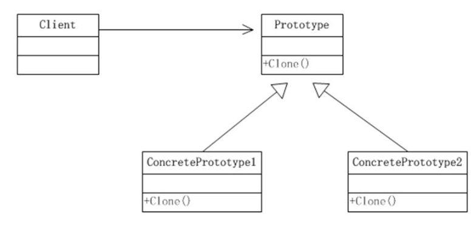

# Prototype Pattern: Creating New Objects via Cloning

The Prototype pattern is a **creational design pattern** that creates new objects by copying — or *cloning* — an existing object. Instead of constructing a new instance from scratch, you duplicate a pre-configured "prototype" object and modify only what differs.

> **Core insight:** When object initialization is expensive or complex, cloning a working instance is far more efficient than building a new one from the ground up.

---

## The Problem It Solves

Consider an object that:
- Has a deeply nested structure with many fields
- Requires expensive initialization (database queries, API calls, heavy computation)
- Needs to exist in many slightly varied configurations

Creating each variation from scratch wastes resources. The Prototype pattern lets you establish a well-configured base object and clone it whenever you need a variation.

---

## Key Components



| Component | Responsibility |
|---|---|
| **Prototype** (interface) | Declares the `clone()` method — the cloning contract |
| **ConcretePrototype** | Implements `clone()`, returning a copy of itself |
| **ConcreteSubclass** | Extends ConcretePrototype, providing its own cloning behavior |
| **Client** | Creates new objects by calling `clone()` on a prototype instance |

---

## Shallow Copy vs. Deep Copy

A critical implementation detail is how deeply the copy is made:

| Type | What it copies | Risk |
|------|---------------|------|
| **Shallow copy** | Copies primitive fields by value; copies reference fields by reference | Shared mutable state between original and clone |
| **Deep copy** | Recursively copies all nested objects | Correct isolation; more expensive to implement |

> ⚠️ For most use cases involving mutable nested objects, you need a **deep copy** to avoid unexpected mutations between the original and its clones.

---

## Language Support

### Java — `Cloneable` Interface

```java
public class UserSettings implements Cloneable {
    private String theme;
    private String language;
    private List<String> notifications; // Mutable — needs deep copy

    public UserSettings(String theme, String language) {
        this.theme = theme;
        this.language = language;
        this.notifications = new ArrayList<>();
    }

    @Override
    protected UserSettings clone() {
        try {
            UserSettings copy = (UserSettings) super.clone(); // Shallow copy
            // Deep copy mutable fields
            copy.notifications = new ArrayList<>(this.notifications);
            return copy;
        } catch (CloneNotSupportedException e) {
            throw new RuntimeException(e);
        }
    }

    public UserSettings withTheme(String newTheme) {
        UserSettings copy = this.clone();
        copy.theme = newTheme;
        return copy;
    }
}

// Usage
UserSettings defaultSettings = new UserSettings("dark", "en");
UserSettings spanishSettings = defaultSettings.withTheme("light");
// defaultSettings is unchanged; spanishSettings has a new theme
```

### C# — `ICloneable` Interface

```csharp
public class Document : ICloneable {
    public string Title { get; set; }
    public string Content { get; set; }
    public List<string> Tags { get; set; }

    public object Clone() {
        return new Document {
            Title = this.Title,
            Content = this.Content,
            Tags = new List<string>(this.Tags) // Deep copy of list
        };
    }
}

// Usage
var original = new Document { Title = "Draft", Content = "Hello", Tags = new List<string> { "tech" } };
var copy = (Document)original.Clone();
copy.Title = "Published";
// original.Title is still "Draft"
```

### TypeScript — Manual Cloning

```typescript
class Shape {
  constructor(
    public x: number,
    public y: number,
    public color: string
  ) {}

  clone(): Shape {
    return new Shape(this.x, this.y, this.color);
  }
}

class Rectangle extends Shape {
  constructor(x: number, y: number, color: string,
              public width: number, public height: number) {
    super(x, y, color);
  }

  clone(): Rectangle {
    return new Rectangle(this.x, this.y, this.color, this.width, this.height);
  }
}

// Prototype registry — a map of pre-configured prototypes
class ShapeRegistry {
  private shapes: Map<string, Shape> = new Map();

  register(key: string, shape: Shape): void { this.shapes.set(key, shape); }
  create(key: string): Shape {
    const shape = this.shapes.get(key);
    if (!shape) throw new Error(`Prototype '${key}' not found`);
    return shape.clone();
  }
}

const registry = new ShapeRegistry();
registry.register('default-rect', new Rectangle(0, 0, 'blue', 100, 50));

// Create variations by cloning
const rect1 = registry.create('default-rect') as Rectangle;
rect1.color = 'red';  // Only this instance is red

const rect2 = registry.create('default-rect') as Rectangle;
// rect2 is still blue — independent clone
```

---

## Real-World Use Cases

| Domain | Use Case |
|--------|---------|
| **Game development** | Clone enemy or NPC configurations instead of initializing from scratch |
| **Document editors** | Duplicate a template document with pre-set styles and structure |
| **Configuration management** | Base config cloned and overridden per environment (dev, staging, prod) |
| **Test fixtures** | Clone a base test object and modify only the relevant fields per test case |
| **GUI components** | Duplicate pre-configured UI widgets with the same layout/style settings |

---

## Prototype Registry

A **Prototype Registry** (or Prototype Factory) stores a set of pre-built prototypes indexed by a key. Clients request a clone by name without knowing the concrete class:

```typescript
// The registry acts as a factory that clones instead of constructing
const shape = registry.create('default-rect'); // Returns a fresh clone each time
```

This pattern is common in game engines and UI frameworks where many object variations exist but differ only slightly from a base template.

---

## Benefits and Trade-offs

| ✅ Benefits | ⚠️ Trade-offs |
|------------|--------------|
| Avoids expensive re-initialization of complex objects | Deep copying complex graphs can be tricky to implement correctly |
| Reduces subclassing — create variations via cloning, not new classes | Circular references in object graphs require special handling |
| Cloning is often faster than constructing from scratch | Shallow copy risks shared mutable state bugs |
| Works without knowing the exact class being cloned (polymorphic cloning) | Not all objects are meaningfully cloneable |

---

## Conclusion

The Prototype pattern is an elegant solution when object creation is expensive, or when you need many similar objects that differ only in small details. By establishing well-configured prototypes and cloning them on demand, you reduce initialization overhead, avoid class proliferation, and enable flexible, runtime object creation — all while keeping your code clean and type-safe.
