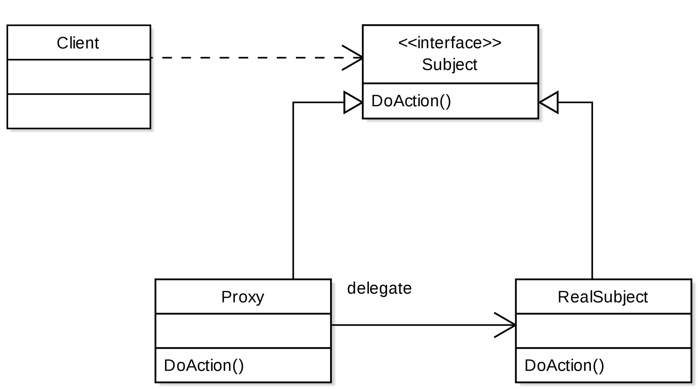
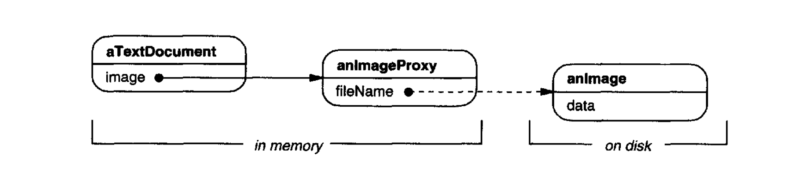

# Proxy Pattern: Controlling Object Access

The Proxy pattern is a **structural design pattern** that provides a surrogate or placeholder for another object. The proxy controls access to the original object, allowing you to perform something before or after the request reaches the actual target.

> **Core idea:** Instead of accessing a resource directly, clients go through a proxy that adds a layer of control — for lazy initialization, access control, caching, logging, or remote communication.

---

## Motivation

Consider a document editor that contains large raster images. When you open the document, you don't need all images to be loaded immediately — only the ones currently visible on screen. Loading all images upfront wastes memory and slows startup.

**Without a proxy:** All images are instantiated and fully loaded when the document opens — even for images that are never scrolled into view.

**With a proxy:** An `ImageProxy` acts as a stand-in for the real image. It stores only the metadata (filename, dimensions). The actual image object is created only when `draw()` is called for the first time — this is **lazy initialization**.

```
Document Editor → ImageProxy (lightweight stand-in)
                    ↓ (on first draw)
                  RealImage (expensive object, created on demand)
```

---

## Structure



| Component | Responsibility |
|---|---|
| **Subject** (interface) | Defines the common interface for the proxy and real object |
| **RealSubject** | The actual object that does the real work |
| **Proxy** | Implements the Subject interface; holds a reference to RealSubject; controls access |
| **Client** | Works only with the Subject interface — unaware of whether it's talking to a proxy or the real object |

---

## Types of Proxies



### 1. Virtual Proxy (Lazy Initialization)

Creates the expensive real object only when it's actually needed.

```typescript
interface Image {
  draw(): void;
}

class RealImage implements Image {
  private data: string;

  constructor(private filename: string) {
    console.log(`Loading image from disk: ${filename}`); // Expensive!
    this.data = `<binary data of ${filename}>`;
  }

  draw(): void {
    console.log(`Drawing image: ${this.filename}`);
  }
}

class ImageProxy implements Image {
  private realImage: RealImage | null = null;

  constructor(private filename: string) {
    // No loading here — proxy is lightweight
  }

  draw(): void {
    if (!this.realImage) {
      this.realImage = new RealImage(this.filename); // Lazy — created on first use
    }
    this.realImage.draw();
  }
}

// Client
const images: Image[] = [
  new ImageProxy('photo1.jpg'),
  new ImageProxy('photo2.jpg'),
  new ImageProxy('photo3.jpg'),
];

// Only photo1 is actually loaded — the others are never drawn
images[0].draw(); // Loading image from disk: photo1.jpg → Drawing image: photo1.jpg
images[0].draw(); // Drawing image: photo1.jpg (no reload — already cached)
```

---

### 2. Remote Proxy

Represents an object located in a different address space (another server, process, or network endpoint). The proxy handles encoding/decoding requests and managing the network communication transparently.

- **Examples:** gRPC stubs, REST client wrappers, Java RMI stubs

```typescript
// The client code thinks it's calling a local object
const userService: UserService = createRemoteProxy('https://api.example.com/users');
const user = await userService.getById('123'); // Actually an HTTP call, hidden by proxy
```

---

### 3. Protection Proxy

Controls access to an object based on permissions or roles. The proxy checks whether the caller has the right to perform an operation before delegating.

```typescript
class AdminUserService implements UserService {
  deleteUser(id: string): void {
    console.log(`Deleting user ${id}`);
  }
}

class ProtectionProxy implements UserService {
  constructor(private realService: UserService, private role: string) {}

  deleteUser(id: string): void {
    if (this.role !== 'admin') {
      throw new Error('Access denied: admin role required');
    }
    this.realService.deleteUser(id);
  }
}

const service = new ProtectionProxy(new AdminUserService(), currentUser.role);
service.deleteUser('123'); // Throws if not admin
```

---

### 4. Caching Proxy

Caches results of expensive operations to avoid redundant computation or network calls.

```typescript
class CachingDataProxy implements DataService {
  private cache: Map<string, any> = new Map();

  constructor(private realService: DataService) {}

  getData(key: string): any {
    if (this.cache.has(key)) {
      console.log(`Cache hit: ${key}`);
      return this.cache.get(key);
    }
    const result = this.realService.getData(key);
    this.cache.set(key, result);
    return result;
  }
}
```

---

## Summary of Proxy Types

| Type | Purpose | Example |
|------|---------|---------|
| **Virtual** | Lazy initialization of expensive objects | Image loading, large file parsing |
| **Remote** | Abstract network/IPC communication | gRPC stubs, REST clients |
| **Protection** | Access control and authorization | Role-based method guards |
| **Caching** | Avoid redundant expensive operations | DB query cache, API response cache |
| **Logging** | Transparently record method calls | Audit logs, debugging wrappers |
| **Smart reference** | Manage object lifecycle (e.g., reference counting) | Memory management in C++ |

---

## Proxy vs. Decorator

Both patterns implement the same interface and wrap another object. The intent differs:

| Aspect | Proxy | Decorator |
|--------|-------|-----------|
| **Intent** | Control access to the object | Add new behavior to the object |
| **Lifecycle** | Often manages the real object's lifecycle | The real object is passed in by the client |
| **Transparency** | Client often doesn't know it's using a proxy | Client explicitly wraps objects with decorators |

---

## Practical Example

[🔗 Lazy loading Proxy example on StackBlitz](https://stackblitz.com/edit/typescript-umzfn2?file=index.ts)

---

## Benefits and Trade-offs

| ✅ Benefits | ⚠️ Trade-offs |
|------------|--------------|
| Controls access without modifying the real subject | Adds an extra layer of indirection |
| Enables lazy initialization for performance | Response time may increase for the first request (virtual proxy) |
| Transparent to the client — uses the same interface | Can complicate code if proxies are deeply nested |
| Supports multiple cross-cutting concerns (caching, logging, auth) | Maintaining synchronization between proxy and real object requires care |

---

## Conclusion

The Proxy pattern is one of the most versatile in the structural pattern family. Whether you're deferring expensive object creation, controlling access with fine-grained permissions, caching results for performance, or abstracting remote service calls, a well-designed proxy keeps your client code clean and decoupled from the complexity it's managing.
