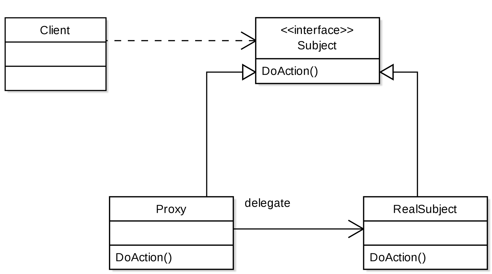

# Proxy Pattern: Controlling Object Access

## Motivation

The Proxy design pattern provides a surrogate or placeholder for another object, allowing us to control access to it. One key reason for using a proxy is to defer the full cost of creating and initializing an object until it's actually needed. For instance, in a document editor with graphical objects, some expensive objects like large raster images should be created only when required, not all at once during document opening, as not all objects may be visible simultaneously.

The solution lies in using an image proxy that serves as a stand-in for the actual image. The proxy behaves like the image and handles instantiation when needed.

When the document editor invokes the Draw operation, the image proxy creates the real image, and subsequent requests are directly forwarded to the image. The proxy keeps a reference to the image after creation to manage further interactions.

## Use Cases

The Proxy pattern is applicable whenever a more versatile or sophisticated reference to an object is required, beyond a simple pointer. Here are common situations where the Proxy pattern is beneficial:

1.  **Remote Proxy**: Responsible for encoding requests and arguments and sending them to the real subject in a different address space. Useful for remote communication scenarios.
    
2.  **Virtual Proxy**: Caches additional information about the real subject, postponing direct access until necessary. For instance, the ImageProxy from the Motivation caches the real image's extent.
    
3.  **Protection Proxy**: Controls access to the original object, providing different access rights. KernelProxies in operating systems offer protected access to operating system objects.

The image proxy creates the real image only when the document editor asks it to display itself by invoking its Draw operation. The proxy forwards subsequent requests directly to the image.It must therefore keep a referenceto the image after creating it.

### Use cases

Proxy is applicable whenever there  **is a need for a more versatile or sophisticated reference to an object than a simple pointer**. Here are several common situations in which the Proxy pattern is applicable:

-   A  **remote proxy**  are responsible for encoding a request and its arguments and for sending the encoded request to the real subject in a different address space.
-   A  **virtual proxy**  may cache additional information about the real subject so that they can postpone accessing it. For example, the ImageProxy from the Motivation caches the real image's extent.
-   A  **protection proxy** controls access to the original object. Protection proxies are useful when objects should have different access rights. For example KernelProxies in operating system's provides protected access to operating system objects.

### Structure

### Example 
[Cool lazy loading proxy example](https://stackblitz.com/edit/typescript-umzfn2?file=index.ts)
