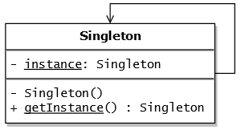

# Singleton Pattern: Ensuring a Single Instance

The Singleton pattern is a **creational design pattern** that ensures a class has **only one instance** throughout the application's lifetime and provides a **global access point** to that instance.

> **When to reach for it:** When exactly one object is needed to coordinate actions across the system — a shared resource, a single point of control, or a global configuration store.

---

## The Problem It Solves

Certain resources should not be duplicated:

- A **database connection pool** — opening multiple pools wastes connections
- A **thread pool** — two pools compete for system threads unpredictably
- A **configuration manager** — multiple instances could read inconsistent state
- A **print spooler** — two spoolers would conflict managing the same printer queue
- An **application logger** — multiple file handlers would corrupt log output

The Singleton pattern enforces that only one instance ever exists, regardless of how many times code attempts to create one.

---

## Structure



The implementation involves three key constraints:

1. **Private constructor** — prevents direct instantiation with `new`
2. **Private static instance** — holds the single instance
3. **Public static `getInstance()` method** — returns the existing instance or creates one if it doesn't exist yet

---

## Implementation

### Basic Singleton (Not Thread-Safe)

```typescript
class DatabasePool {
  private static instance: DatabasePool | null = null;
  private connectionCount = 0;

  // Private constructor — can't be called with `new` from outside
  private constructor(private maxConnections: number) {
    console.log(`DatabasePool initialized with ${maxConnections} max connections`);
  }

  static getInstance(): DatabasePool {
    if (!DatabasePool.instance) {
      DatabasePool.instance = new DatabasePool(10);
    }
    return DatabasePool.instance;
  }

  getConnection(): string {
    if (this.connectionCount < this.maxConnections) {
      this.connectionCount++;
      return `Connection #${this.connectionCount}`;
    }
    throw new Error('Connection pool exhausted');
  }

  releaseConnection(): void {
    if (this.connectionCount > 0) this.connectionCount--;
  }
}

// Usage
const pool1 = DatabasePool.getInstance();
const pool2 = DatabasePool.getInstance();
console.log(pool1 === pool2); // true — same instance
```

---

### Thread-Safe Singleton in Java

In multithreaded environments, naive Singleton implementations can fail — two threads may simultaneously check `instance == null` and both create separate instances.

#### Double-Checked Locking

```java
public class DatabasePool {
    // volatile ensures visibility across threads
    private static volatile DatabasePool instance;

    private DatabasePool() {
        // expensive initialization
    }

    public static DatabasePool getInstance() {
        if (instance == null) {
            synchronized (DatabasePool.class) {
                // Second check inside the lock
                if (instance == null) {
                    instance = new DatabasePool();
                }
            }
        }
        return instance;
    }
}
```

#### Bill Pugh Solution (Preferred in Java)

The most elegant thread-safe Singleton uses the class loader's initialization guarantee:

```java
public class DatabasePool {
    private DatabasePool() {}

    // Inner class is not loaded until getInstance() is called
    private static class Holder {
        private static final DatabasePool INSTANCE = new DatabasePool();
    }

    public static DatabasePool getInstance() {
        return Holder.INSTANCE; // Thread-safe — class initialization is atomic
    }
}
```

#### Enum Singleton (Joshua Bloch's recommendation)

```java
public enum AppConfig {
    INSTANCE;

    private final String dbUrl = System.getenv("DATABASE_URL");

    public String getDatabaseUrl() { return dbUrl; }
}

// Usage
AppConfig.INSTANCE.getDatabaseUrl();
```

Enum Singletons are inherently thread-safe, serialize-safe, and reflection-safe.

---

## Thread Safety Comparison

| Approach | Thread-Safe | Performance | Simplicity |
|---|---|---|---|
| **Naive (no sync)** | ❌ | ✅ Fast | ✅ Simple |
| **Synchronized method** | ✅ | ❌ Slow (every call locks) | ✅ Simple |
| **Double-checked locking** | ✅ | ✅ Fast after init | ⚠️ Verbose |
| **Bill Pugh (Holder class)** | ✅ | ✅ Fast | ✅ Clean |
| **Enum** | ✅ | ✅ Fast | ✅ Simplest |

---

## Real-World Use Cases

| Use Case | Why Singleton? |
|---|---|
| **Database connection pool** | One pool shared across the application; controls max connections |
| **Application logger** | Single log file handler prevents write conflicts |
| **Configuration manager** | One source of truth for all config values |
| **Cache manager** | Shared in-memory cache accessible throughout the app |
| **Event bus / message broker** | Single dispatcher routes events between components |

---

## Singleton and Dependency Injection

Modern applications often avoid direct Singleton access (`MySingleton.getInstance()`) in favor of **Dependency Injection**. The DI container manages the lifecycle:

```java
// Spring Boot — scope="singleton" is the default for @Bean
@Bean
@Scope("singleton")
public DatabasePool databasePool() {
    return new DatabasePool(10);
}

// Classes receive the singleton via injection — no static access
@Service
public class UserService {
    private final DatabasePool pool;

    public UserService(DatabasePool pool) { // Injected — not getInstance()
        this.pool = pool;
    }
}
```

This approach preserves testability — you can inject a mock in tests — while still guaranteeing a single instance in production.

---

## Pitfalls and Anti-Patterns

| Pitfall | Description | Solution |
|---------|-------------|----------|
| **Global state** | Singleton introduces hidden global state, making code hard to test | Use DI instead of static access |
| **Thread safety** | Naive implementation breaks in concurrent environments | Use double-checked locking or Bill Pugh |
| **Violation of SRP** | Singleton manages both its own lifecycle and its business logic | Keep business logic clean; use DI containers |
| **Tight coupling** | Code calling `getInstance()` is tightly coupled to the concrete class | Inject through interfaces |

---

## Conclusion

The Singleton pattern is one of the most recognized — and most misused — patterns in software. It solves a genuine problem when you need exactly one instance of a resource-managing class. However, when overused, it becomes a form of global state that makes code difficult to test and reason about.

Modern practice favors managing singleton lifecycles through **IoC containers** (Spring, Dagger, Guice) rather than implementing the pattern manually — giving you the benefits of a single instance without the downsides of static coupling.
