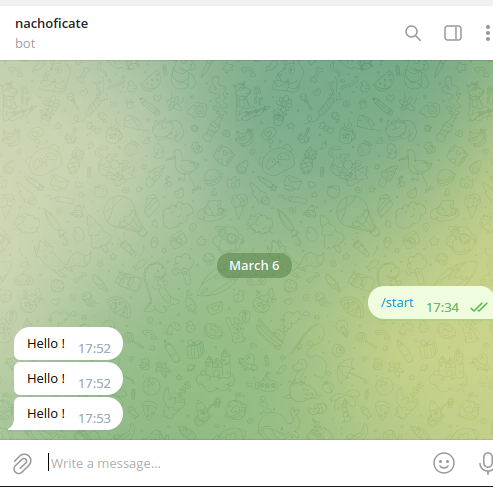

# Sending Telegram Messages via Webhook

Telegram's Bot API makes it trivially easy to send automated messages — from alert notifications to system health updates — directly to a chat or group. This guide walks you through the complete setup in minutes.

---

## Prerequisites

- A Telegram account
- Any HTTP client (curl, Postman, your backend service, or n8n)

---

## Step 1: Create a Bot with BotFather

1. Open Telegram and start a conversation with **[@BotFather](https://t.me/botfather)**
2. Run the `/newbot` command
3. Choose a display name and a unique username (must end in `bot`, e.g., `my_alert_bot`)
4. **Save the HTTP API token** — you'll need it for every API call

> 🔒 **Keep your token secret.** Anyone with your token can send messages as your bot.

---

## Step 2: Find Your Chat ID

Your Chat ID is a unique identifier for the conversation where the bot will send messages. To find it:

1. Send any message to your bot (or add it to a group)
2. Make a `GET` request to:

```
https://api.telegram.org/bot<YOUR_TOKEN>/getUpdates
```

3. Look for the `chat.id` field in the JSON response:

```json
{
  "ok": true,
  "result": [{
    "message": {
      "chat": {
        "id": 123456789,
        "type": "private"
      },
      "text": "Hello"
    }
  }]
}
```

The `chat.id` value (`123456789` in this example) is what you'll use in the next step.

---

## Step 3: Send a Message

Use the `sendMessage` endpoint:

```
https://api.telegram.org/bot<TOKEN>/sendMessage?chat_id=<CHAT_ID>&parse_mode=html&text=<MESSAGE>
```

### Using curl

```bash
curl -X GET "https://api.telegram.org/bot123456:ABC-DEF/sendMessage?chat_id=123456789&text=Hello+from+the+bot"
```

### With HTML formatting

```bash
curl -X GET "https://api.telegram.org/bot<TOKEN>/sendMessage" \
  --data-urlencode "chat_id=123456789" \
  --data-urlencode "parse_mode=html" \
  --data-urlencode "text=<b>Alert:</b> Server CPU usage is at <b>95%</b>"
```

### Using n8n (no-code automation)

```
GET https://api.telegram.org/bot{{ $json.bot_token }}/sendMessage?chat_id={{ $json.chat_id }}&parse_mode=html&text={{ $json.message }}
```

---

## Supported Message Formats

Telegram supports three `parse_mode` options:

| Mode | Supported Tags | Example |
|------|---------------|---------|
| `html` | `<b>`, `<i>`, `<code>`, `<pre>`, `<a href>` | `<b>Bold</b> text` |
| `MarkdownV2` | `*bold*`, `_italic_`, `` `code` ``, `[link](url)` | `*Bold* text` |
| *(none)* | Plain text only | `Plain text message` |

### HTML Example

```html
<b>🚨 Production Alert</b>

Service: <code>payment-service</code>
Status: <b>DOWN</b>
Time: 2024-06-01 14:32:00 UTC

<a href="https://dashboard.example.com">View Dashboard</a>
```

---

## Practical Integration Example

### Send Alerts from a Bash Script

```bash
#!/bin/bash

BOT_TOKEN="your_token_here"
CHAT_ID="your_chat_id_here"

send_telegram() {
    local message="$1"
    curl -s -X POST "https://api.telegram.org/bot${BOT_TOKEN}/sendMessage" \
        -d chat_id="${CHAT_ID}" \
        -d parse_mode="html" \
        -d text="${message}"
}

# Usage in monitoring scripts
DISK_USAGE=$(df -h / | awk 'NR==2 {print $5}')
if [[ "${DISK_USAGE%?}" -gt 90 ]]; then
    send_telegram "<b>⚠️ Disk Warning</b>
Host: <code>$(hostname)</code>
Disk usage: <b>${DISK_USAGE}</b>"
fi
```

### Screenshot: Nachoficate Bot in Action



---

## Common Use Cases

| Use Case | Example Message |
|----------|----------------|
| **Deployment notifications** | "✅ Service X v2.1.0 deployed to production" |
| **Error alerts** | "🚨 Payment service returned 500 — 47 errors in last 5 min" |
| **CI/CD pipeline status** | "🔴 Build #142 failed on `main` branch" |
| **Monitoring alerts** | "⚠️ CPU usage > 90% on server-prod-01" |
| **Daily reports** | "📊 Daily stats: 1,204 orders, $48,200 revenue" |

---

## Tips and Best Practices

- **Rate limits:** Telegram allows up to 30 messages/second per bot globally, and 1 message/second per chat. Use queuing for high-volume scenarios.
- **Group bots:** Add the bot to a group and use the group's negative Chat ID (e.g., `-100123456789`).
- **Disable link preview:** Add `disable_web_page_preview=true` to avoid unfurled links in alerts.
- **Webhooks vs. polling:** For production, use Telegram's webhook mode to receive updates — push instead of poll.

---

## Conclusion

The Telegram Bot API is one of the most developer-friendly messaging APIs available. With a few API calls and no SDK required, you can integrate real-time notifications into any script, service, or automation pipeline — making it ideal for infrastructure alerts, deployment pipelines, and monitoring dashboards.
